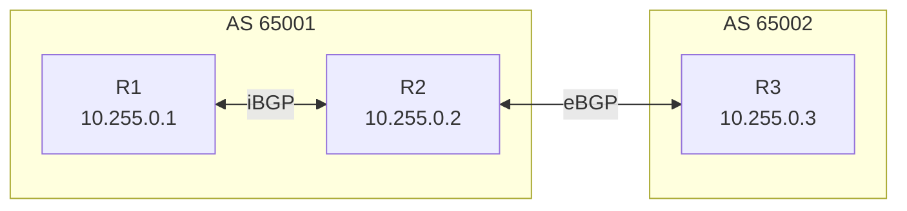
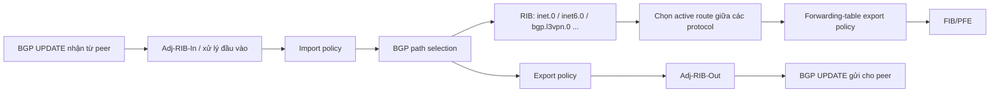
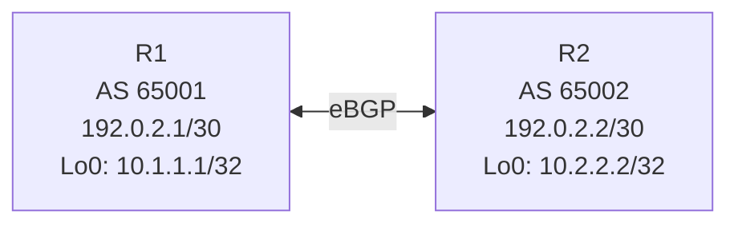
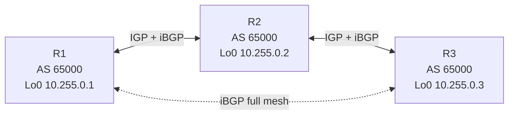
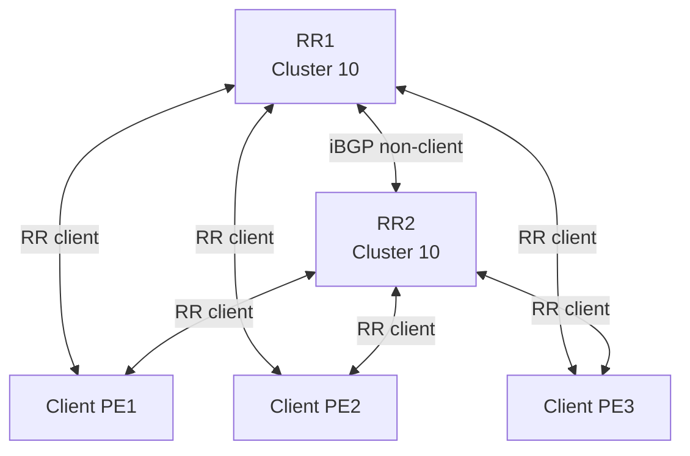
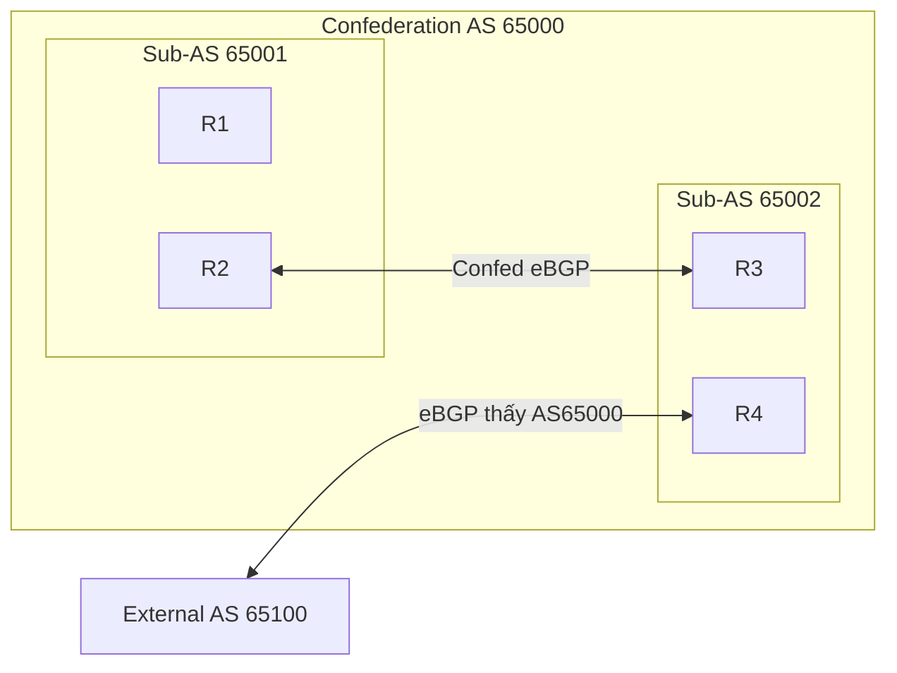
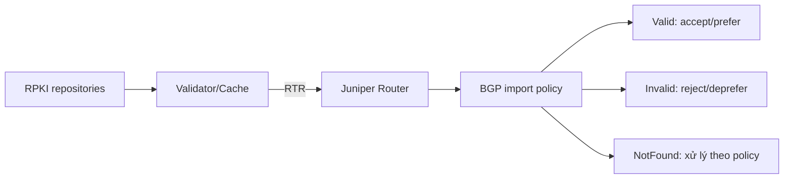
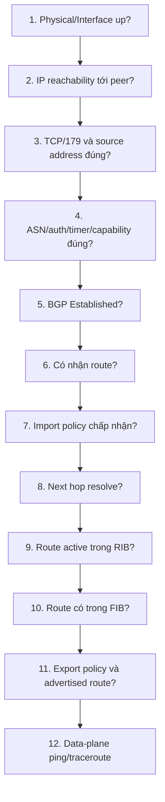
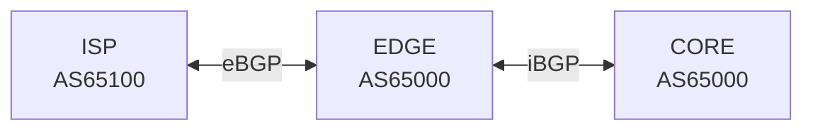
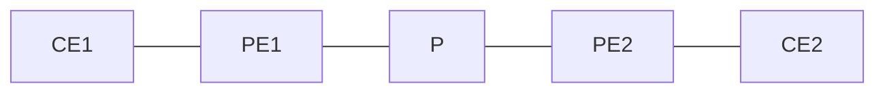

# GIÁO TRÌNH BGP TRÊN JUNOS OS

> **Mục tiêu:** Tổng hợp có hệ thống kiến thức BGP và cách triển khai trên Juniper Junos OS, từ nền tảng đến vận hành mạng ISP/Core, MPLS VPN và Data Center.  
> **Nguồn chính:** Bộ tài liệu **BGP User Guide** của Juniper Networks, các topic map liên quan đến BGP Overview, Peering Sessions, Routing Policies, Route Reflector, Multiprotocol BGP, Multipath, Security, BFD, Graceful Restart và Troubleshooting.  
> **Ngày tổng hợp:** 13/07/2026.  
> **Lưu ý:** Khả năng hỗ trợ câu lệnh và tính năng phụ thuộc nền tảng cùng phiên bản Junos OS/Junos OS Evolved. Luôn kiểm tra Juniper Feature Explorer trước khi triển khai thực tế.

---

## MỤC LỤC

1. [BGP là gì?](#1-bgp-là-gì)
2. [Các khái niệm nền tảng](#2-các-khái-niệm-nền-tảng)
3. [eBGP và iBGP](#3-ebgp-và-ibgp)
4. [Phiên BGP, TCP và máy trạng thái BGP](#4-phiên-bgp-tcp-và-máy-trạng-thái-bgp)
5. [Các bản tin BGP](#5-các-bản-tin-bgp)
6. [BGP route, RIB, FIB và next-hop resolution](#6-bgp-route-rib-fib-và-next-hop-resolution)
7. [Thuộc tính đường đi BGP](#7-thuộc-tính-đường-đi-bgp)
8. [Thuật toán chọn đường BGP trên Junos](#8-thuật-toán-chọn-đường-bgp-trên-junos)
9. [Mô hình cấu hình BGP trên Junos](#9-mô-hình-cấu-hình-bgp-trên-junos)
10. [Cấu hình eBGP cơ bản](#10-cấu-hình-ebgp-cơ-bản)
11. [Cấu hình iBGP cơ bản](#11-cấu-hình-ibgp-cơ-bản)
12. [BGP multihop và peering bằng loopback](#12-bgp-multihop-và-peering-bằng-loopback)
13. [Routing policy cho BGP](#13-routing-policy-cho-bgp)
14. [Điều khiển lưu lượng bằng BGP](#14-điều-khiển-lưu-lượng-bằng-bgp)
15. [Community, Extended Community và Large Community](#15-community-extended-community-và-large-community)
16. [Route Reflector](#16-route-reflector)
17. [BGP Confederation](#17-bgp-confederation)
18. [Multiprotocol BGP](#18-multiprotocol-bgp)
19. [BGP Multipath, ECMP và Add-Path](#19-bgp-multipath-ecmp-và-add-path)
20. [Quảng bá, tổng hợp và sinh route](#20-quảng-bá-tổng-hợp-và-sinh-route)
21. [Khả năng hội tụ và tính sẵn sàng cao](#21-khả-năng-hội-tụ-và-tính-sẵn-sàng-cao)
22. [Bảo mật BGP](#22-bảo-mật-bgp)
23. [Giới hạn prefix và bảo vệ tài nguyên](#23-giới-hạn-prefix-và-bảo-vệ-tài-nguyên)
24. [RPKI và BGP Origin Validation](#24-rpki-và-bgp-origin-validation)
25. [Route flap damping và xử lý UPDATE lỗi](#25-route-flap-damping-và-xử-lý-update-lỗi)
26. [Giám sát và troubleshooting](#26-giám-sát-và-troubleshooting)
27. [Bộ lab từ cơ bản đến nâng cao](#27-bộ-lab-từ-cơ-bản-đến-nâng-cao)
28. [Cheat sheet lệnh Junos BGP](#28-cheat-sheet-lệnh-junos-bgp)
29. [Checklist triển khai production](#29-checklist-triển-khai-production)
30. [Tài liệu tham khảo chính thức](#30-tài-liệu-tham-khảo-chính-thức)

---

# 1. BGP LÀ GÌ?

## 1.1 Định nghĩa

**Border Gateway Protocol (BGP)** là giao thức định tuyến kiểu **path-vector**, dùng để trao đổi thông tin khả năng tiếp cận mạng giữa các **Autonomous System – AS**.

BGP thường được dùng trong các môi trường:

- Kết nối giữa các ISP.
- Doanh nghiệp multihoming tới nhiều ISP.
- Mạng Core IP/MPLS.
- MPLS Layer 3 VPN.
- EVPN/VXLAN.
- BGP labeled-unicast.
- BGP FlowSpec chống DDoS.
- BGP-LS phục vụ SDN/Traffic Engineering.
- Data Center spine–leaf.

BGP hiện hành là **BGP-4**, hỗ trợ CIDR, route aggregation, 4-byte ASN và nhiều address family thông qua MP-BGP.

## 1.2 Vì sao BGP khác OSPF và IS-IS?

| Tiêu chí | BGP | OSPF/IS-IS |
|---|---|---|
| Loại giao thức | Exterior Gateway Protocol, path-vector | Interior Gateway Protocol, link-state |
| Phạm vi | Giữa AS hoặc phân phối route quy mô lớn | Bên trong một miền quản trị |
| Cơ chế chọn đường | Thuộc tính và policy | Cost/metric và SPF |
| Transport | TCP port 179 | Chạy trực tiếp trên IP hoặc Layer 2 |
| Mục tiêu | Khả năng mở rộng và kiểm soát chính sách | Hội tụ nhanh, tìm đường ngắn trong nội bộ |
| Số lượng route | Có thể mang bảng Internet rất lớn | Không phù hợp để mang full Internet table |
| Kiểm soát | Rất mạnh, policy-driven | Chủ yếu dựa vào metric |

BGP không nhất thiết chọn đường ngắn nhất theo số router hoặc độ trễ. BGP chọn đường theo **chính sách** và chuỗi tiêu chí xác định trước.

## 1.3 Các đặc điểm quan trọng

- Dùng **TCP port 179**.
- Chỉ gửi update khi có thay đổi, không gửi toàn bộ bảng định tuyến theo chu kỳ.
- Có cơ chế chống loop bằng **AS_PATH**.
- Hỗ trợ CIDR và route aggregation.
- Có khả năng mở rộng bằng AFI/SAFI và các capability.
- Có thể dùng import/export policy để lọc hoặc sửa thuộc tính route.
- Có thể vận chuyển nhiều loại NLRI ngoài IPv4 unicast.

---

# 2. CÁC KHÁI NIỆM NỀN TẢNG

## 2.1 Autonomous System

Một **AS** là tập hợp router và mạng dưới cùng một chính sách quản trị, thể hiện ra bên ngoài bằng một ASN.

### ASN 2 byte và 4 byte

- ASN 2 byte: phạm vi lịch sử từ 0 đến 65535.
- ASN 4 byte: mở rộng tới 4,294,967,295.
- Junos hỗ trợ dạng số nguyên và dạng `high.low`.

Ví dụ:

```text
ASN dạng số nguyên: 65546
ASN dạng asdot:     1.10
```

### ASN private thường gặp

- Dải 16-bit private: `64512–65534`.
- Dải 32-bit private: `4200000000–4294967294`.

Không nên quảng bá private ASN ra Internet công cộng. Khi cần, dùng policy hoặc `remove-private`.

## 2.2 NLRI

**Network Layer Reachability Information** mô tả prefix và loại thông tin định tuyến được trao đổi.

Ví dụ:

- IPv4 unicast.
- IPv6 unicast.
- IPv4 labeled-unicast.
- VPNv4/VPNv6.
- EVPN.
- FlowSpec.
- BGP-LS.

## 2.3 BGP peer, neighbor và group

- **Peer/neighbor:** thiết bị BGP ở đầu kia của phiên TCP.
- **Group:** nhóm neighbor có chung cấu hình hoặc policy.
- Junos khuyến nghị nhóm các peer có đặc điểm giống nhau vào cùng group để giảm lặp cấu hình và tối ưu tài nguyên.

## 2.4 Router ID

Router ID là giá trị 32 bit có dạng IPv4, dùng nhận diện BGP speaker.

Nên cấu hình tường minh:

```junos
set routing-options router-id 10.255.0.1
```

Không nên phụ thuộc vào việc hệ thống tự chọn router ID, vì thay đổi địa chỉ interface có thể gây thay đổi định danh và reset phiên.

## 2.5 BGP local preference và Junos route preference

Hai khái niệm này rất dễ nhầm:

### Local Preference

- Là **BGP path attribute**.
- Giá trị cao hơn được ưu tiên.
- Dùng để chọn lối ra khỏi AS.
- Thường truyền giữa các iBGP peer.
- Giá trị mặc định thường là 100.

### Junos Route Preference

- Là độ ưu tiên giữa các giao thức, tương tự administrative distance.
- Giá trị thấp hơn được ưu tiên.
- BGP route trên Junos có preference mặc định là **170** cho cả eBGP và iBGP.
- Sau khi route BGP thắng ở bước protocol preference, Junos mới tiếp tục so sánh các thuộc tính BGP.

---

# 3. EBGP VÀ IBGP

## 3.1 eBGP

eBGP là BGP giữa hai peer thuộc ASN khác nhau.

Đặc điểm thường gặp:

- Peer trực tiếp dùng địa chỉ interface kết nối.
- TTL mặc định của single-hop eBGP thường giới hạn ở một hop.
- Khi quảng bá route qua eBGP, router thêm ASN của mình vào AS_PATH.
- NEXT_HOP thường thay đổi thành địa chỉ của router quảng bá.
- Dùng để kết nối ISP–ISP, ISP–customer hoặc doanh nghiệp–ISP.

## 3.2 iBGP

iBGP là BGP giữa các router cùng ASN.

Đặc điểm:

- Không thêm ASN vào AS_PATH khi trao đổi nội bộ.
- NEXT_HOP nhận từ eBGP thường được giữ nguyên.
- Peer không bắt buộc trực tiếp; thường dùng loopback.
- IGP phải đảm bảo reachability tới địa chỉ loopback và BGP next hop.
- Route học từ một iBGP peer mặc định **không được quảng bá sang iBGP peer khác**.

## 3.3 Quy tắc full mesh iBGP

Vì iBGP không quảng bá route học từ iBGP sang iBGP khác, mạng iBGP thuần cần full mesh.

Số phiên:

```text
N × (N - 1) / 2
```

Ví dụ:

| Số router BGP | Số phiên full mesh |
|---:|---:|
| 3 | 3 |
| 5 | 10 |
| 10 | 45 |
| 100 | 4.950 |

Để mở rộng, dùng:

- Route Reflector.
- BGP Confederation.

## 3.4 Sơ đồ eBGP và iBGP



---

# 4. PHIÊN BGP, TCP VÀ MÁY TRẠNG THÁI BGP

## 4.1 Thiết lập phiên

Quy trình tổng quát:

1. Có IP reachability giữa hai peer.
2. Một phía mở TCP tới port 179.
3. Hai bên trao đổi OPEN.
4. Thương lượng ASN, BGP version, hold time, router ID và capability.
5. Trao đổi KEEPALIVE.
6. Chuyển sang Established.
7. Trao đổi UPDATE.

## 4.2 Các trạng thái BGP

| Trạng thái | Ý nghĩa |
|---|---|
| Idle | Khởi tạo, chờ bắt đầu kết nối |
| Connect | Đang chờ hoàn tất TCP |
| Active | TCP chưa thành công, tiếp tục thử lại |
| OpenSent | Đã gửi OPEN, chờ OPEN từ peer |
| OpenConfirm | Đã nhận OPEN hợp lệ, chờ KEEPALIVE |
| Established | Phiên đã hình thành, có thể trao đổi route |

### Cách đọc nhanh khi troubleshooting

- **Idle:** cấu hình chưa kích hoạt, peer bị shutdown hoặc lỗi nghiêm trọng.
- **Connect/Active:** thường là lỗi IP reachability, TCP/179, source address, firewall, TTL hoặc peer IP.
- **OpenSent:** thường là mismatch ASN, authentication, capability hoặc router ID.
- **OpenConfirm:** kiểm tra timer, capability, notification.
- **Established nhưng không có route:** kiểm tra family, policy, prefix, next-hop và hidden route.

## 4.3 Timer

Các timer thường quan tâm:

- Hold time.
- Keepalive.
- Connect retry.
- Idle hold.
- BFD detection timer.

Không nên giảm BGP timer quá thấp trên số lượng lớn peer nếu chưa đánh giá CPU/rpd. Khi cần phát hiện lỗi nhanh, BFD thường phù hợp hơn.

---

# 5. CÁC BẢN TIN BGP

## 5.1 Header chung

BGP message có header gồm:

- Marker.
- Length.
- Type.

## 5.2 OPEN

Chứa:

- BGP version.
- Local ASN.
- Hold time.
- BGP identifier.
- Optional parameters/capabilities.

Capability có thể gồm:

- Multiprotocol.
- Route refresh.
- 4-byte ASN.
- Graceful restart.
- Add-Path.
- Long-lived graceful restart.

## 5.3 UPDATE

Dùng để:

- Quảng bá prefix mới.
- Thu hồi prefix.
- Mang path attributes.
- Mang NLRI.

Các trường chính:

- Withdrawn routes.
- Path attributes.
- NLRI.

Với MP-BGP, NLRI và next hop thường được mang trong:

- `MP_REACH_NLRI`.
- `MP_UNREACH_NLRI`.

## 5.4 KEEPALIVE

- Duy trì phiên.
- Không mang route.
- Ngăn hold timer hết hạn.

## 5.5 NOTIFICATION

Gửi khi phát hiện lỗi nghiêm trọng. Sau đó phiên BGP thường bị đóng.

Ví dụ nguyên nhân:

- Bad peer AS.
- Unsupported version.
- Authentication failure.
- Hold timer expired.
- Malformed UPDATE.
- Administrative shutdown.

## 5.6 ROUTE-REFRESH

Cho phép yêu cầu peer gửi lại route mà không cần hard reset phiên, nếu hai bên hỗ trợ capability route refresh.

---

# 6. BGP ROUTE, RIB, FIB VÀ NEXT-HOP RESOLUTION

## 6.1 Luồng route trong Junos



## 6.2 Các bảng thường gặp

| Bảng | Công dụng |
|---|---|
| `inet.0` | IPv4 unicast |
| `inet6.0` | IPv6 unicast |
| `inet.3` | MPLS next-hop resolution cho BGP/LSP |
| `mpls.0` | MPLS forwarding |
| `bgp.l3vpn.0` | VPNv4/VPNv6 route trong control plane |
| `<vrf>.inet.0` | IPv4 route trong VRF |
| `bgp.evpn.0` | EVPN NLRI |
| `inetflow.0` | IPv4 FlowSpec |
| `inet6flow.0` | IPv6 FlowSpec |
| `lsdist.0` | BGP-LS/link-state distribution |

## 6.3 Active, inactive và hidden

- `*`: active route.
- `+`: last active hoặc trạng thái phụ thuộc output.
- Hidden route: route không đủ điều kiện trở thành active.

Nguyên nhân hidden thường gặp:

- Next hop không resolve được.
- Import policy reject.
- AS loop.
- Martian route.
- Unusable next hop.
- Prefix limit/hide-excess.
- Malformed attribute.
- Route damping.

Kiểm tra:

```junos
show route hidden
show route <prefix> hidden detail
show route <prefix> extensive
```

## 6.4 Next-hop resolution

iBGP route thường mang protocol next hop ở xa. Junos phải dùng route khác để resolve next hop, ví dụ:

- Direct route.
- Static route.
- OSPF/IS-IS route.
- RSVP LSP.
- LDP/SR/LSP tùy kiến trúc và bảng resolution.

Nếu next hop không resolve được, route BGP không thể active.

Kiểm tra:

```junos
show route <bgp-prefix> extensive
show route <next-hop> exact
show route resolution
show route table inet.3
show route forwarding-table destination <prefix>
```

---

# 7. THUỘC TÍNH ĐƯỜNG ĐI BGP

## 7.1 Phân loại

| Loại | Đặc điểm |
|---|---|
| Well-known mandatory | Mọi implementation phải hiểu và phải có trong UPDATE phù hợp |
| Well-known discretionary | Mọi implementation phải hiểu, không bắt buộc luôn xuất hiện |
| Optional transitive | Không hiểu vẫn phải chuyển tiếp, đánh dấu partial khi cần |
| Optional non-transitive | Không hiểu thì không chuyển tiếp |

## 7.2 ORIGIN

Giá trị:

| Giá trị | Ký hiệu | Ý nghĩa | Mức ưu tiên |
|---:|---|---|---|
| 0 | I | IGP | Cao nhất |
| 1 | E | EGP | Trung gian |
| 2 | ? | Incomplete | Thấp nhất |

Không nên nhầm ORIGIN với nguồn protocol hiện tại của route.

## 7.3 AS_PATH

Là chuỗi ASN route đã đi qua.

Công dụng:

- Chống loop.
- Chọn đường.
- Điều khiển inbound traffic bằng prepend.
- Lọc route theo nguồn hoặc đường đi.

Ví dụ:

```text
65010 65020 65030 I
```

Router trong AS65020 sẽ loại route này nếu thấy ASN của chính mình, trừ khi cấu hình loop allowance đặc biệt.

## 7.4 NEXT_HOP

Cho biết địa chỉ cần chuyển packet đến.

Điểm cần nhớ:

- eBGP thường đổi next hop.
- iBGP thường giữ nguyên next hop.
- Khi iBGP peer không có route tới eBGP next hop, dùng IGP hoặc `next-hop self`.

Junos policy:

```junos
set policy-options policy-statement NEXT-HOP-SELF term 1 then next-hop self
set policy-options policy-statement NEXT-HOP-SELF term 1 then accept
set protocols bgp group IBGP export NEXT-HOP-SELF
```

## 7.5 LOCAL_PREF

- Giá trị cao hơn tốt hơn.
- Chỉ có ý nghĩa nội bộ AS.
- Dùng chọn lối ra.
- Thường không quảng bá sang eBGP.

Ví dụ:

```junos
set policy-options policy-statement ISP-A-IN term PREFER then local-preference 200
set policy-options policy-statement ISP-A-IN term PREFER then accept
set protocols bgp group ISP-A import ISP-A-IN
```

## 7.6 MED

- Giá trị thấp hơn tốt hơn.
- Dùng gợi ý AS láng giềng chọn điểm vào AS của mình.
- Optional non-transitive.
- Mặc định thường chỉ so sánh giữa route có cùng neighboring AS.
- Có thể dùng `always-compare-med`, nhưng phải hiểu tác động toàn mạng.

Ví dụ:

```junos
set policy-options policy-statement SET-MED term DC1 then metric 50
set policy-options policy-statement SET-MED term DC1 then accept
set protocols bgp group TRANSIT export SET-MED
```

## 7.7 ATOMIC_AGGREGATE và AGGREGATOR

Liên quan route aggregation:

- `ATOMIC_AGGREGATE` báo rằng thông tin đường đi chi tiết có thể đã bị mất khi aggregate.
- `AGGREGATOR` cho biết ASN và router ID đã tạo aggregate.

## 7.8 COMMUNITY

Gắn nhãn logic cho route để áp dụng policy hàng loạt.

Ví dụ:

```text
65000:100 = customer route
65000:200 = peer route
65000:300 = transit route
```

## 7.9 ORIGINATOR_ID và CLUSTER_LIST

Dùng trong route reflection:

- `ORIGINATOR_ID`: router ID của client đầu tiên phát route.
- `CLUSTER_LIST`: danh sách cluster ID route đã đi qua.

Dùng để chống loop trong mạng RR.

## 7.10 AIGP

**Accumulated IGP Metric** giúp mang metric tích lũy qua nhiều AS thuộc cùng một miền quản trị.

Phù hợp cho:

- Một tổ chức chia mạng thành nhiều ASN.
- Mạng cần chọn đường gần giống shortest path xuyên các AS nội bộ.
- Hạ tầng tunnel hoặc BGP LU.

---

# 8. THUẬT TOÁN CHỌN ĐƯỜNG BGP TRÊN JUNOS

## 8.1 Hai lớp quyết định

Junos thực hiện hai khái niệm liên quan:

1. **Chọn best path trong các đường BGP cho cùng prefix.**
2. **Chọn active route giữa BGP và các protocol khác trong RIB.**

Route preference thấp hơn thắng giữa protocol. Trong nhóm BGP, các thuộc tính BGP quyết định.

## 8.2 Trình tự chọn đường quan trọng

Trình tự tổng quát trên Junos:

1. Next hop phải resolve được.
2. Preference thấp hơn được ưu tiên.
3. Local preference cao hơn.
4. AIGP thấp hơn nếu AIGP được bật.
5. AS_PATH ngắn hơn.
6. ORIGIN thấp hơn: IGP < EGP < Incomplete.
7. MED thấp hơn theo quy tắc so sánh MED.
8. Ưu tiên strictly internal/local route trong bước tương ứng.
9. eBGP tốt hơn iBGP.
10. IGP cost tới BGP next hop thấp hơn.
11. Với hai eBGP path, thường ưu tiên path cũ hơn để giảm flap, trừ các ngoại lệ.
12. Router ID của peer thấp hơn.
13. CLUSTER_LIST ngắn hơn.
14. Peer IP thấp hơn.
15. Primary route được ưu tiên hơn secondary route trong trường hợp liên quan.

> Không nên học một câu mnemonic quá ngắn rồi áp dụng máy móc. Khi troubleshooting, dùng `show route <prefix> extensive` để xem chính xác `Inactive reason`.

## 8.3 Các tùy chọn path-selection

Ví dụ cấu trúc:

```junos
set protocols bgp path-selection always-compare-med
set protocols bgp path-selection external-router-id
set protocols bgp path-selection as-path-ignore
```

### Cảnh báo

- `as-path-ignore` bỏ qua độ dài AS_PATH, có thể làm thay đổi lớn chính sách.
- `cisco-non-deterministic` chỉ nên dùng khi cần tương thích hành vi; Juniper không khuyến nghị dùng tùy tiện.
- `always-compare-med` phải được triển khai nhất quán để tránh lựa chọn không mong muốn.

## 8.4 Ví dụ phân tích

Giả sử một prefix có ba path:

| Path | Local Pref | AS_PATH | MED | Loại |
|---|---:|---|---:|---|
| A | 200 | 65010 65020 | 100 | iBGP |
| B | 150 | 65030 | 10 | eBGP |
| C | 200 | 65040 | 300 | eBGP |

Kết quả:

1. A và C thắng B vì local-pref 200 > 150.
2. C thắng A vì AS_PATH của C ngắn hơn.
3. Không cần xét eBGP/iBGP vì quyết định đã có ở bước AS_PATH.

---

# 9. MÔ HÌNH CẤU HÌNH BGP TRÊN JUNOS

## 9.1 Cấu trúc cơ bản

```junos
routing-options {
    router-id 10.255.0.1;
    autonomous-system 65001;
}

protocols {
    bgp {
        group GROUP-NAME {
            type internal | external;
            local-address 10.255.0.1;
            family inet {
                unicast;
            }
            import IMPORT-POLICY;
            export EXPORT-POLICY;
            neighbor 10.255.0.2 {
                peer-as 65002;
            }
        }
    }
}
```

## 9.2 Kế thừa cấu hình

BGP trên Junos có thể cấu hình ở các mức:

1. Global BGP.
2. Group.
3. Neighbor.
4. Family trong global/group/neighbor.

Cấu hình cụ thể hơn thường ghi đè hoặc bổ sung cấu hình cấp trên.

Ví dụ:

```junos
set protocols bgp hold-time 90
set protocols bgp group ISP hold-time 60
set protocols bgp group ISP neighbor 192.0.2.2 hold-time 30
```

Neighbor `192.0.2.2` dùng hold time 30; peer khác trong group dùng 60; group khác dùng 90.

## 9.3 Group internal

```junos
set protocols bgp group IBGP type internal
set protocols bgp group IBGP local-address 10.255.0.1
set protocols bgp group IBGP family inet unicast
set protocols bgp group IBGP neighbor 10.255.0.2
```

Trong group internal, `peer-as` thường không cần vì peer dùng cùng local AS.

## 9.4 Group external

```junos
set protocols bgp group ISP-A type external
set protocols bgp group ISP-A peer-as 65002
set protocols bgp group ISP-A neighbor 192.0.2.2
```

Có thể đặt `peer-as` ở group nếu các neighbor cùng ASN.

## 9.5 Routing instance

BGP có thể chạy trong VRF/routing instance:

```junos
set routing-instances CUSTOMER-A instance-type vrf
set routing-instances CUSTOMER-A interface ge-0/0/0.100
set routing-instances CUSTOMER-A route-distinguisher 65000:100
set routing-instances CUSTOMER-A vrf-target target:65000:100
set routing-instances CUSTOMER-A protocols bgp group CE type external
set routing-instances CUSTOMER-A protocols bgp group CE peer-as 65100
set routing-instances CUSTOMER-A protocols bgp group CE neighbor 10.10.100.2
```

Interface nhận gói BGP phải nằm đúng routing instance với cấu hình neighbor.

---

# 10. CẤU HÌNH EBGP CƠ BẢN

## 10.1 Topology



## 10.2 R1

```junos
set interfaces ge-0/0/0 unit 0 family inet address 192.0.2.1/30
set interfaces lo0 unit 0 family inet address 10.1.1.1/32

set routing-options router-id 10.1.1.1
set routing-options autonomous-system 65001

set policy-options policy-statement EXPORT-LOCAL term LOOPBACK from route-filter 10.1.1.1/32 exact
set policy-options policy-statement EXPORT-LOCAL term LOOPBACK then accept
set policy-options policy-statement EXPORT-LOCAL term REJECT then reject

set protocols bgp group EBGP-R2 type external
set protocols bgp group EBGP-R2 peer-as 65002
set protocols bgp group EBGP-R2 neighbor 192.0.2.2
set protocols bgp group EBGP-R2 export EXPORT-LOCAL
```

## 10.3 R2

```junos
set interfaces ge-0/0/0 unit 0 family inet address 192.0.2.2/30
set interfaces lo0 unit 0 family inet address 10.2.2.2/32

set routing-options router-id 10.2.2.2
set routing-options autonomous-system 65002

set policy-options policy-statement EXPORT-LOCAL term LOOPBACK from route-filter 10.2.2.2/32 exact
set policy-options policy-statement EXPORT-LOCAL term LOOPBACK then accept
set policy-options policy-statement EXPORT-LOCAL term REJECT then reject

set protocols bgp group EBGP-R1 type external
set protocols bgp group EBGP-R1 peer-as 65001
set protocols bgp group EBGP-R1 neighbor 192.0.2.1
set protocols bgp group EBGP-R1 export EXPORT-LOCAL
```

## 10.4 Kiểm tra

```junos
show bgp summary
show bgp neighbor 192.0.2.2
show route protocol bgp
show route 10.2.2.2/32 detail
show route receive-protocol bgp 192.0.2.2
show route advertising-protocol bgp 192.0.2.2
ping 10.2.2.2 source 10.1.1.1
```

---

# 11. CẤU HÌNH IBGP CƠ BẢN

## 11.1 Topology



## 11.2 Điều kiện

- Mỗi loopback phải được IGP quảng bá.
- Ping được loopback peer với source loopback.
- Cấu hình `local-address` bằng loopback.
- Nếu không dùng RR, mọi iBGP router phải full mesh.

## 11.3 Cấu hình mẫu R1

```junos
set routing-options router-id 10.255.0.1
set routing-options autonomous-system 65000

set protocols bgp group IBGP type internal
set protocols bgp group IBGP local-address 10.255.0.1
set protocols bgp group IBGP family inet unicast
set protocols bgp group IBGP neighbor 10.255.0.2
set protocols bgp group IBGP neighbor 10.255.0.3
```

## 11.4 Lỗi next hop phổ biến

R2 học route từ ISP qua eBGP rồi truyền sang R1 qua iBGP. R1 có thể thấy route nhưng hidden nếu không reach được eBGP next hop.

Cách xử lý:

1. Quảng bá subnet eBGP vào IGP; hoặc
2. Dùng next-hop self ở border router.

```junos
set policy-options policy-statement NH-SELF term ALL then next-hop self
set policy-options policy-statement NH-SELF term ALL then accept
set protocols bgp group IBGP export NH-SELF
```

Trong mạng MPLS Core, không nên áp dụng next-hop self máy móc nếu thiết kế yêu cầu BGP next hop trỏ tới PE/ASBR cụ thể.

---

# 12. BGP MULTIHOP VÀ PEERING BẰNG LOOPBACK

## 12.1 Khi nào cần multihop?

- eBGP peer không trực tiếp.
- eBGP dùng loopback để tăng độ bền.
- Kết nối qua nhiều đường vật lý.
- Inter-AS Option B/C, route server hoặc thiết kế đặc biệt.

## 12.2 Điều kiện

- Có route hai chiều tới loopback peer.
- Source address đúng.
- TTL đủ lớn.
- ACL/firewall cho phép TCP/179.
- Authentication giống nhau nếu dùng.

## 12.3 Cấu hình

```junos
set routing-options static route 10.255.0.2/32 next-hop 192.0.2.2

set protocols bgp group EBGP-MH type external
set protocols bgp group EBGP-MH local-address 10.255.0.1
set protocols bgp group EBGP-MH peer-as 65002
set protocols bgp group EBGP-MH neighbor 10.255.0.2 multihop ttl 2
```

Nếu cần giữ next hop:

```junos
set protocols bgp group EBGP-MH neighbor 10.255.0.2 multihop no-nexthop-change
```

## 12.4 Kiểm tra

```junos
ping 10.255.0.2 source 10.255.0.1
telnet 10.255.0.2 179 source 10.255.0.1
show bgp neighbor 10.255.0.2
show route 10.255.0.2 exact
```

---

# 13. ROUTING POLICY CHO BGP

## 13.1 Nguyên tắc

Junos là hệ điều hành định tuyến **policy-driven**.

- `import`: xử lý route nhận từ protocol trước khi đưa vào routing table.
- `export`: xử lý route từ routing table trước khi quảng bá vào protocol.
- Policy phải được tạo và áp dụng mới có hiệu lực.
- Policy chain được đánh giá theo thứ tự.
- Khi gặp hành động dứt khoát `accept` hoặc `reject`, đánh giá dừng.

## 13.2 Cấu trúc policy

```junos
policy-options {
    policy-statement POLICY-NAME {
        term TERM-1 {
            from {
                protocol bgp;
                route-filter 203.0.113.0/24 exact;
            }
            then {
                local-preference 200;
                community add CUSTOMER;
                accept;
            }
        }
        term DEFAULT {
            then reject;
        }
    }
}
```

## 13.3 Các điều kiện match thường dùng

```junos
from protocol bgp
from neighbor 192.0.2.2
from route-filter 203.0.113.0/24 exact
from route-filter 203.0.113.0/24 orlonger
from route-filter 203.0.113.0/24 upto /28
from prefix-list CUSTOMER-PREFIXES
from community CUSTOMER
from as-path CUSTOMER-AS
from family inet
from rib inet.0
```

## 13.4 Các action thường dùng

```junos
then accept
then reject
then next policy
then next term
then local-preference 200
then preference 150
then metric 50
then next-hop self
then as-path-prepend "65000 65000 65000"
then community add CUSTOMER
then community set CUSTOMER
then community delete CUSTOMER
then origin igp
```

## 13.5 Quảng bá static/direct vào BGP

Mặc định, BGP trên Junos không tự quảng bá mọi route của protocol khác. Phải dùng export policy.

```junos
set routing-options static route 203.0.113.0/24 discard

set policy-options policy-statement EXPORT-PUBLIC term PUBLIC from protocol static
set policy-options policy-statement EXPORT-PUBLIC term PUBLIC from route-filter 203.0.113.0/24 exact
set policy-options policy-statement EXPORT-PUBLIC term PUBLIC then accept
set policy-options policy-statement EXPORT-PUBLIC term DENY then reject

set protocols bgp group ISP export EXPORT-PUBLIC
```

Dùng route discard cho prefix aggregate/public phải bảo đảm có đường forwarding cụ thể hoặc có chủ đích blackhole. Sai cấu hình có thể gây mất lưu lượng.

## 13.6 Prefix list

```junos
set policy-options prefix-list CUSTOMER-A 10.10.0.0/16
set policy-options prefix-list CUSTOMER-A 10.20.0.0/16

set policy-options policy-statement CUSTOMER-A-IN term ALLOW from prefix-list CUSTOMER-A
set policy-options policy-statement CUSTOMER-A-IN term ALLOW then accept
set policy-options policy-statement CUSTOMER-A-IN term DENY then reject
```

## 13.7 AS path regular expression

```junos
set policy-options as-path FROM-AS65010 "^65010$"
set policy-options as-path TRANSIT-AS65010 ".* 65010 .*"
```

Ý nghĩa cần kiểm tra theo cú pháp regex của Junos. Trước khi áp dụng production, thử với route thật và `show route`/policy test phù hợp.

## 13.8 Chính sách an toàn tối thiểu

### Import từ customer

- Chỉ nhận prefix customer được cấp.
- Giới hạn độ dài prefix.
- Chặn default nếu không thỏa thuận.
- Chặn bogon/martian.
- Gắn community.
- Đặt local-pref theo loại quan hệ.
- Prefix limit.

### Export tới customer

- Chỉ quảng bá default hoặc route đã thỏa thuận.
- Không để customer nhận full table ngoài ý muốn.
- Không quảng bá route của customer khác nếu chính sách không cho phép.

### Import từ transit

- Chặn prefix của chính mình.
- Chặn private/bogon.
- RPKI validation.
- Prefix limit.
- Gắn community transit.
- Local-pref thấp hơn peer/customer.

---

# 14. ĐIỀU KHIỂN LƯU LƯỢNG BẰNG BGP

## 14.1 Outbound traffic

Outbound là lưu lượng từ AS của mình đi ra ngoài.

Công cụ chính:

1. Local Preference.
2. Weight tương đương không phải thuộc tính chuẩn; Junos thường dùng local-pref/preference/policy.
3. IGP cost tới next hop.
4. Multipath.
5. AIGP trong thiết kế phù hợp.

### Ví dụ ưu tiên ISP-A

```junos
set policy-options policy-statement ISP-A-IN term ALL then local-preference 200
set policy-options policy-statement ISP-A-IN term ALL then accept
set protocols bgp group ISP-A import ISP-A-IN

set policy-options policy-statement ISP-B-IN term ALL then local-preference 150
set policy-options policy-statement ISP-B-IN term ALL then accept
set protocols bgp group ISP-B import ISP-B-IN
```

## 14.2 Inbound traffic

Inbound là lưu lượng Internet đi vào AS của mình.

Công cụ:

1. AS_PATH prepend.
2. MED với cùng AS láng giềng hoặc khi hai bên thống nhất.
3. Provider communities.
4. Quảng bá prefix cụ thể hơn.
5. Selective advertisement.
6. BGP conditional advertisement.

### AS prepend

```junos
set policy-options policy-statement TO-ISP-B term PUBLIC from route-filter 203.0.113.0/24 exact
set policy-options policy-statement TO-ISP-B term PUBLIC then as-path-prepend "65000 65000 65000"
set policy-options policy-statement TO-ISP-B term PUBLIC then accept
set policy-options policy-statement TO-ISP-B term DENY then reject
```

Không prepend quá mức vì:

- Có mạng giới hạn AS_PATH.
- Nhiều mạng ưu tiên local-pref trước AS_PATH.
- Có thể làm đường dự phòng không bao giờ được dùng hoặc bị lọc.

## 14.3 More-specific route

Ví dụ:

- Quảng bá `/23` tới cả hai ISP.
- Quảng bá thêm `/24` thứ nhất tới ISP-A.
- Quảng bá thêm `/24` thứ hai tới ISP-B.

Longest-prefix match thường ảnh hưởng mạnh hơn thuộc tính BGP. Phải tuân thủ chính sách lọc prefix Internet và không quảng bá dài hơn ngưỡng được chấp nhận.

## 14.4 Quan hệ customer–peer–provider

Thông lệ local-pref:

| Loại route | Local-pref ví dụ |
|---|---:|
| Customer | 300 |
| Peer | 200 |
| Transit/provider | 100 |

Mục tiêu:

- Ưu tiên route từ customer vì tạo doanh thu.
- Sau đó route từ peer.
- Cuối cùng mới dùng transit trả phí.

---

# 15. COMMUNITY, EXTENDED COMMUNITY VÀ LARGE COMMUNITY

## 15.1 Standard community

Dạng:

```text
ASN:value
```

Ví dụ:

```junos
set policy-options community CUSTOMER members 65000:100
set policy-options community PEER members 65000:200
set policy-options community TRANSIT members 65000:300
```

## 15.2 Well-known community

| Community | Ý nghĩa |
|---|---|
| `no-export` | Không quảng bá ra ngoài confederation/AS theo quy tắc |
| `no-advertise` | Không quảng bá cho bất kỳ BGP peer nào |
| `no-export-subconfed` | Hạn chế ra khỏi sub-confederation |
| `internet` | Nhóm Internet theo định nghĩa cộng đồng chuẩn |
| `graceful-shutdown` | Hỗ trợ hạ local-pref trong bảo trì theo RFC tương ứng |

Ví dụ:

```junos
set policy-options community NO-EXPORT members no-export
set policy-options policy-statement TAG-NO-EXPORT term 1 then community add NO-EXPORT
set policy-options policy-statement TAG-NO-EXPORT term 1 then accept
```

## 15.3 Extended Community

Dùng trong:

- Route target của MPLS VPN/EVPN.
- Route origin.
- Color.
- Traffic engineering.
- FlowSpec action.

Ví dụ:

```junos
set policy-options community RT-CUST-A members target:65000:100
```

## 15.4 Large Community

Dạng ba số 32 bit:

```text
GlobalAdministrator:LocalData1:LocalData2
```

Ưu điểm:

- Không bị giới hạn như standard community khi dùng 4-byte ASN.
- Dễ phân chia chức năng.

Mô hình gợi ý:

```text
65000:100:10 = route customer tại miền 10
65000:200:20 = route peer tại miền 20
65000:300:30 = route transit tại miền 30
```

## 15.5 Thiết kế community production

Nên có tài liệu quy ước:

- Community nguồn route.
- Community vị trí POP/region.
- Community để customer điều khiển prepend.
- Community blackhole.
- Community no-export.
- Community local-pref.
- Community cho DDoS scrubbing.

Không tái sử dụng cùng giá trị cho nhiều nghĩa.

---

# 16. ROUTE REFLECTOR

## 16.1 Vấn đề mà RR giải quyết

iBGP full mesh không mở rộng tốt. RR cho phép phản xạ route iBGP giữa các client.



## 16.2 Quy tắc quảng bá

RR thường xử lý:

- Route từ **client**: phản xạ tới client khác và non-client.
- Route từ **non-client**: phản xạ tới client, không phản xạ sang non-client khác.
- Route eBGP/local: quảng bá theo policy và quy tắc BGP bình thường.

## 16.3 Thuộc tính chống loop

- ORIGINATOR_ID.
- CLUSTER_LIST.

RR từ chối route chứa cluster ID của chính nó trong cluster list.

## 16.4 Cấu hình RR

### RR

```junos
set routing-options router-id 10.255.0.10
set routing-options autonomous-system 65000

set protocols bgp group RR-CLIENTS type internal
set protocols bgp group RR-CLIENTS local-address 10.255.0.10
set protocols bgp group RR-CLIENTS cluster 10.255.0.10
set protocols bgp group RR-CLIENTS family inet unicast
set protocols bgp group RR-CLIENTS neighbor 10.255.0.1
set protocols bgp group RR-CLIENTS neighbor 10.255.0.2
set protocols bgp group RR-CLIENTS neighbor 10.255.0.3
```

### Client

```junos
set routing-options autonomous-system 65000
set protocols bgp group RR type internal
set protocols bgp group RR local-address 10.255.0.1
set protocols bgp group RR neighbor 10.255.0.10
```

## 16.5 Hai RR dự phòng

Khuyến nghị:

- Mỗi client peer với ít nhất hai RR.
- IGP reachability độc lập.
- Xem xét cluster ID theo thiết kế.
- Không đặt toàn bộ RR trên cùng failure domain.
- Theo dõi path hiding.
- Xem xét Add-Path hoặc diverse-path nếu cần tăng path diversity.

## 16.6 Non-forwarding RR

RR chỉ làm control plane có thể không cần cài route vào FIB.

```junos
set protocols bgp family inet unicast no-install
```

Tính năng phụ thuộc release/platform. Dùng khi RR không nằm trên data path.

## 16.7 Path hiding

RR chỉ phản xạ best path có thể che mất path tốt hơn theo góc nhìn của client.

Giải pháp tùy thiết kế:

- Đặt RR gần topology.
- Dùng nhiều RR.
- Add-Path.
- Diverse-path.
- ORR/optimal route reflection nếu nền tảng hỗ trợ.
- BGP-LS/PCE trong thiết kế SDN.

---

# 17. BGP CONFEDERATION

## 17.1 Khái niệm

Confederation chia một AS lớn thành nhiều sub-AS.

Bên ngoài, toàn bộ mạng vẫn xuất hiện như một confederation ASN chung.



## 17.2 Đặc điểm

- Trong mỗi sub-AS vẫn có yêu cầu iBGP full mesh hoặc RR.
- Giữa sub-AS dùng confederation eBGP.
- Một số hành vi giống eBGP, nhưng thông tin confed không bị lộ ra ngoài theo cách AS_PATH công cộng.
- Chống loop bằng confederation sequence/set.

## 17.3 Khi nào dùng?

- AS rất lớn.
- Muốn chia miền quản trị nhưng vẫn xuất hiện một ASN ngoài Internet.
- Cần kiểm soát policy giữa các vùng như eBGP.
- Mạng cũ đã dùng confederation.

Trong nhiều mạng mới, RR thường đơn giản hơn. Confederation tăng độ phức tạp vận hành và troubleshooting.

## 17.4 Cấu hình khái niệm

```junos
set routing-options autonomous-system 65001
set routing-options confederation 65000 members 65002
```

Cú pháp chi tiết và hỗ trợ phải được xác minh theo release.

---

# 18. MULTIPROTOCOL BGP

## 18.1 MP-BGP là gì?

MP-BGP mở rộng BGP để mang nhiều address family.

Hai thuộc tính cốt lõi:

- MP_REACH_NLRI.
- MP_UNREACH_NLRI.

## 18.2 AFI/SAFI thường gặp

| Family Junos | Mục đích |
|---|---|
| `family inet unicast` | IPv4 unicast |
| `family inet6 unicast` | IPv6 unicast |
| `family inet labeled-unicast` | IPv4 prefix kèm MPLS label |
| `family inet6 labeled-unicast` | IPv6 prefix kèm MPLS label |
| `family inet-vpn unicast` | VPNv4 |
| `family inet6-vpn unicast` | VPNv6 |
| `family l2vpn signaling` | L2VPN/VPLS signaling |
| `family evpn signaling` | EVPN |
| `family route-target` | Route Target Constraint |
| `family inet flow` | IPv4 FlowSpec |
| `family inet6 flow` | IPv6 FlowSpec |
| `family traffic-engineering` | BGP-LS/TE tùy ngữ cảnh |
| `family inet-mvpn signaling` | Multicast VPN |

## 18.3 Cấu hình IPv6 unicast

```junos
set protocols bgp group IBGP-V6 type internal
set protocols bgp group IBGP-V6 local-address 2001:db8:ffff::1
set protocols bgp group IBGP-V6 family inet6 unicast
set protocols bgp group IBGP-V6 neighbor 2001:db8:ffff::2
```

## 18.4 VPNv4 trong MPLS L3VPN

Trên PE/RR:

```junos
set protocols bgp group CORE type internal
set protocols bgp group CORE local-address 10.255.0.1
set protocols bgp group CORE family inet-vpn unicast
set protocols bgp group CORE neighbor 10.255.0.10
```

Trong VRF:

```junos
set routing-instances CUST-A instance-type vrf
set routing-instances CUST-A route-distinguisher 10.255.0.1:100
set routing-instances CUST-A vrf-target target:65000:100
```

### Route Distinguisher và Route Target

- **RD:** làm route VPN trở thành duy nhất trong BGP control plane.
- **RT:** extended community điều khiển import/export route giữa VRF.
- RD không phải policy; RT mới quyết định membership VPN.

## 18.5 Route Target Constraint

Giúp RR/PE chỉ nhận VPN route có RT cần thiết, giảm số route và tài nguyên.

```junos
set protocols bgp group CORE family route-target
```

## 18.6 BGP FlowSpec

FlowSpec phân phối rule match/action bằng BGP.

Match có thể gồm:

- Source/destination prefix.
- Protocol.
- Source/destination port.
- TCP flags.
- Packet length.
- Fragment.
- DSCP.

Action có thể gồm:

- Discard.
- Rate limit.
- Redirect VRF/IP.
- Mark DSCP.
- Traffic action.

Cần kiểm soát chặt import policy vì một FlowSpec rule sai có thể gây gián đoạn diện rộng.

## 18.7 BGP-LS

BGP-LS đưa topology và TE information từ IGP/TED tới controller/PCE.

Ứng dụng:

- SDN controller.
- Segment Routing TE.
- Network analytics.
- Path computation.

BGP-LS không thay thế IGP trong forwarding nội bộ.

---

# 19. BGP MULTIPATH, ECMP VÀ ADD-PATH

## 19.1 Multipath

Mặc định BGP chọn một best path. Multipath cho phép cài nhiều path tương đương vào forwarding table.

```junos
set protocols bgp multipath
```

Hoặc theo group/neighbor tùy release:

```junos
set protocols bgp group ISP multipath
```

## 19.2 Điều kiện path tương đương

Các path phải vượt qua các bước chính của path selection và chỉ khác tại tie-break phù hợp. IGP cost tới next hop có vai trò quan trọng.

Không nên giả định hai route có cùng local-pref và AS_PATH là tự động ECMP. Kiểm tra output thực tế.

## 19.3 Forwarding-table load balancing

Một số thiết kế cần policy forwarding table:

```junos
set policy-options policy-statement LOAD-BALANCE term 1 then load-balance per-packet
set routing-options forwarding-table export LOAD-BALANCE
```

Trên Junos, tên `per-packet` trong nhiều nền tảng thực tế thực hiện hash theo flow, không phải luân phiên từng packet. Hành vi cụ thể phụ thuộc platform/PFE.

## 19.4 Kiểm tra

```junos
show route <prefix> extensive
show route forwarding-table destination <prefix>
show route forwarding-table destination <prefix> extensive
```

## 19.5 Add-Path

Add-Path cho phép quảng bá nhiều path cho cùng NLRI, thay vì chỉ best path.

Lợi ích:

- Giảm path hiding qua RR.
- Tăng path diversity.
- Cải thiện hội tụ.
- Hỗ trợ multipath ở downstream.

Khái niệm cấu hình:

```junos
set protocols bgp group RR family inet unicast add-path receive
set protocols bgp group RR family inet unicast add-path send path-count 4
```

Cú pháp và giới hạn path-count phụ thuộc release/platform.

## 19.6 Multipath khác Add-Path

| Tính năng | Mục tiêu |
|---|---|
| Multipath | Cài nhiều path vào FIB để load balance |
| Add-Path | Quảng bá nhiều path qua BGP |
| Diverse Path | Quảng bá path khác best path theo vai trò |
| PIC | Chuẩn bị backup next hop để hội tụ nhanh |

---

# 20. QUẢNG BÁ, TỔNG HỢP VÀ SINH ROUTE

## 20.1 Static discard để tạo aggregate

```junos
set routing-options static route 203.0.112.0/23 discard
```

Sau đó export chính xác:

```junos
set policy-options policy-statement EXPORT-AGG term 1 from route-filter 203.0.112.0/23 exact
set policy-options policy-statement EXPORT-AGG term 1 then accept
set policy-options policy-statement EXPORT-AGG term 99 then reject
```

## 20.2 Aggregate route

```junos
set routing-options aggregate route 203.0.112.0/23
```

Aggregate thường active khi có contributing route phù hợp.

Có thể cấu hình policy và thuộc tính aggregate. Phải kiểm tra AS_PATH/community được tạo ra.

## 20.3 Generated route

Generated route tương tự aggregate nhưng có thể kế thừa next hop từ contributing route theo hành vi/configuration.

Dùng khi cần default hoặc summary phụ thuộc route hiện hữu.

## 20.4 Default route

### Static default

```junos
set routing-options static route 0.0.0.0/0 next-hop 192.0.2.1
```

### Quảng bá default qua BGP

```junos
set policy-options policy-statement EXPORT-DEFAULT term 1 from route-filter 0.0.0.0/0 exact
set policy-options policy-statement EXPORT-DEFAULT term 1 then accept
set policy-options policy-statement EXPORT-DEFAULT term 99 then reject
```

Nên dùng conditional logic nếu chỉ muốn quảng bá default khi upstream hoạt động.

## 20.5 Conditional advertisement

Dùng để quảng bá hoặc cài prefix khi một route điều kiện tồn tại hoặc không tồn tại.

Ứng dụng:

- Failover đa ISP.
- Chỉ quảng bá default khi có upstream.
- Chỉ quảng bá backup prefix khi primary mất.

Cần lab kỹ để tránh route oscillation.

---

# 21. KHẢ NĂNG HỘI TỤ VÀ TÍNH SẴN SÀNG CAO

## 21.1 Route Refresh và soft re-evaluation

Khi thay đổi policy, route refresh cho phép yêu cầu peer gửi lại route.

```junos
clear bgp neighbor 192.0.2.2 soft
clear bgp neighbor 192.0.2.2 soft-inbound
```

Cú pháp khả dụng phụ thuộc release. Kiểm tra `clear bgp neighbor ?`.

Không dùng hard clear nếu soft clear đủ đáp ứng, vì hard clear rút toàn bộ route và reset TCP.

## 21.2 BFD

BFD phát hiện lỗi forwarding path nhanh hơn timer BGP.

Cấu hình tối thiểu:

```junos
set protocols bgp group ISP neighbor 192.0.2.2 bfd-liveness-detection minimum-interval 300
set protocols bgp group ISP neighbor 192.0.2.2 bfd-liveness-detection multiplier 3
```

Thời gian phát hiện xấp xỉ:

```text
minimum-interval × multiplier
```

### BFD strict mode

BGP chỉ lên Established sau khi BFD ổn định.

```junos
set protocols bgp group ISP neighbor 192.0.2.2 bfd-liveness-detection strict-bfd
set protocols bgp group ISP neighbor 192.0.2.2 bfd-liveness-detection strict-bfd bfd-up-wait-interval 20
```

Không đặt timer quá thấp trên thiết bị không đủ tài nguyên.

## 21.3 Graceful Restart

Mục tiêu:

- Giữ forwarding trong lúc control plane khởi động lại.
- Peer helper giữ route stale trong thời gian cho phép.
- Sau khi phiên trở lại, route được đồng bộ và stale state được xóa.

Rủi ro:

- Có thể giữ route lỗi/blackhole nếu forwarding thực tế không còn.
- Phải hiểu forwarding-state bit.
- Không thay thế thiết kế HA đầy đủ.

## 21.4 Long-Lived Graceful Restart

LLGR giữ stale route lâu hơn graceful restart chuẩn và đánh dấu bằng community như `LLGR_STALE`.

Dùng cho peer phục hồi chậm, nhưng phải đánh giá:

- Khả năng blackhole.
- Chính sách hạ ưu tiên stale route.
- Khả năng tương thích NLRI.
- Tương tác với NSR/GR.

## 21.5 GRES và NSR

- **GRES:** duy trì kernel/interface state khi Routing Engine chuyển đổi.
- **NSR:** đồng bộ state routing protocol sang backup RE, giảm phụ thuộc helper.
- BGP NSR chạy rpd ở backup RE và sao chép protocol state.

Cần kiểm tra tính tương thích giữa:

- NSR.
- Graceful Restart.
- BFD.
- Authentication.
- RIB sharding/update threading.
- Platform dual-RE.

## 21.6 Graceful Shutdown

Trước maintenance, có thể gắn graceful-shutdown community và hạ local-pref để drain traffic trước khi đóng phiên.

Quy trình:

1. Gắn community GSHUT.
2. Hạ local-pref.
3. Chờ traffic giảm.
4. Shutdown phiên/interface.
5. Bảo trì.
6. Khôi phục và gỡ policy.

---

# 22. BẢO MẬT BGP

## 22.1 Nguyên tắc nhiều lớp

1. Chỉ cho phép peer hợp lệ kết nối TCP/179.
2. Xác thực session.
3. Giới hạn TTL/GTSM.
4. Lọc prefix import/export.
5. Prefix limit.
6. RPKI origin validation.
7. Chặn route leak.
8. Giám sát thay đổi route và session.
9. Bảo vệ Routing Engine.
10. Quản lý key rotation.

## 22.2 TCP MD5

Ví dụ static key:

```junos
set protocols bgp group ISP neighbor 192.0.2.2 authentication-key "SECRET"
```

Hai đầu phải giống nhau. Tránh lưu/chia sẻ secret trong tài liệu công khai.

## 22.3 TCP-AO

TCP Authentication Option mạnh hơn MD5 và hỗ trợ key rollover tốt hơn trên nền tảng/release hỗ trợ.

Đặc điểm:

- Dùng keychain.
- Có thể thay key theo thời gian.
- Hỗ trợ thuật toán mạnh hơn.
- Cần đồng bộ clock/NTP.
- Hai đầu phải tương thích TCP-AO.

## 22.4 Keychain

Khái niệm:

```junos
security {
    authentication-key-chains {
        key-chain BGP-KEYCHAIN {
            key 1 {
                secret "...";
                start-time "2026-07-13.00:00:00 +0700";
            }
        }
    }
}
```

Sau đó gắn keychain vào BGP theo cú pháp release hỗ trợ.

## 22.5 GTSM/TTL Security

GTSM dùng TTL để xác minh peer gần về mặt hop-count. Kẻ tấn công ở xa khó gửi packet với TTL còn đúng ngưỡng khi tới router.

Áp dụng đặc biệt cho eBGP trực tiếp. Kiểm tra cú pháp `ttl`, `ttl-security` hoặc tương đương theo release.

## 22.6 Control-plane firewall filter

Ví dụ tạo prefix-list tự động từ neighbor:

```junos
set policy-options prefix-list BGP-PEERS apply-path "protocols bgp group <*> neighbor <*>"
```

Filter mẫu:

```junos
set firewall family inet filter PROTECT-RE term ALLOW-BGP from source-prefix-list BGP-PEERS
set firewall family inet filter PROTECT-RE term ALLOW-BGP from protocol tcp
set firewall family inet filter PROTECT-RE term ALLOW-BGP from destination-port bgp
set firewall family inet filter PROTECT-RE term ALLOW-BGP then accept
set firewall family inet filter PROTECT-RE term DENY-OTHER-BGP from protocol tcp
set firewall family inet filter PROTECT-RE term DENY-OTHER-BGP from destination-port bgp
set firewall family inet filter PROTECT-RE term DENY-OTHER-BGP then discard
```

Phải có các term cho SSH, routing protocol, ICMP, BFD, NTP và traffic quản trị cần thiết trước term deny cuối.

## 22.7 SRX host-inbound traffic

Trên SRX, phải cho phép BGP tới thiết bị trong zone:

```junos
set security zones security-zone TRUST host-inbound-traffic protocols bgp
```

Hoặc theo interface:

```junos
set security zones security-zone TRUST interfaces ge-0/0/1.0 host-inbound-traffic protocols bgp
```

## 22.8 Chống route leak

- Import/export explicit.
- BGP role và OTC nếu hỗ trợ.
- Community policy.
- Không quảng bá route học từ transit sang transit/peer ngoài chủ đích.
- Max-prefix.
- Prefix/AS-path filter.
- RPKI.
- Monitoring route count và AS_PATH bất thường.

---

# 23. GIỚI HẠN PREFIX VÀ BẢO VỆ TÀI NGUYÊN

## 23.1 Prefix limit

Mục tiêu:

- Ngăn peer gửi quá nhiều route.
- Bảo vệ memory/CPU.
- Phát hiện route leak.

Ví dụ khái niệm:

```junos
set protocols bgp group CUSTOMER family inet unicast prefix-limit maximum 1000
set protocols bgp group CUSTOMER family inet unicast prefix-limit teardown 90
```

## 23.2 Accepted-prefix-limit

Giới hạn route sau khi import policy chấp nhận.

Các hành động tùy cấu hình:

- Teardown session.
- Idle timeout.
- Drop excess.
- Hide excess.
- Log theo phần trăm ngưỡng.

Ví dụ:

```junos
set protocols bgp group CUSTOMER family inet unicast accepted-prefix-limit maximum 500
set protocols bgp group CUSTOMER family inet unicast accepted-prefix-limit teardown 90 idle-timeout 30
```

## 23.3 Chọn ngưỡng

Không đặt đúng bằng số route hiện tại.

Cách làm:

1. Đo số route bình thường.
2. Xác định tăng trưởng.
3. Thêm headroom.
4. Đặt warning threshold.
5. Quyết định teardown hay hide/drop.
6. Xây runbook khôi phục.

Ví dụ:

- Bình thường 400 route.
- Dự kiến tăng 20%.
- Maximum 600.
- Warning 80–90%.
- Teardown khi vượt nếu đây là customer nhỏ.

Với full table từ transit, ngưỡng phải cập nhật theo tăng trưởng Internet và theo IPv4/IPv6 riêng.

## 23.4 Rủi ro teardown

Teardown có thể làm gián đoạn dịch vụ. Nếu route leak tạm thời, session có thể lặp up/down. Dùng `idle-timeout` và cảnh báo NOC.

---

# 24. RPKI VÀ BGP ORIGIN VALIDATION

## 24.1 Mục tiêu

BGP Origin Validation kiểm tra ASN phát sinh prefix có được chủ sở hữu tài nguyên cho phép hay không.

Thành phần:

1. RIR/RPKI repository.
2. ROA.
3. RPKI validator/cache.
4. RTR protocol.
5. Router Junos.
6. Routing policy dựa trên validation state.

## 24.2 Trạng thái

| Trạng thái | Ý nghĩa |
|---|---|
| Valid | Prefix và origin AS phù hợp ROA |
| Invalid | Có ROA nhưng ASN hoặc prefix length không phù hợp |
| NotFound/Unknown | Không có ROA phù hợp |

## 24.3 Luồng



## 24.4 Chính sách triển khai

Giai đoạn an toàn:

1. Chỉ monitor validation state.
2. Gắn community theo Valid/Invalid/NotFound.
3. Đo tác động.
4. Hạ local-pref Invalid.
5. Cuối cùng reject Invalid khi tổ chức sẵn sàng.

Không nên reject NotFound vì nhiều prefix hợp lệ chưa có ROA.

## 24.5 Kiểm tra

Tùy release:

```junos
show validation session
show validation database
show route <prefix> extensive
show route protocol bgp validation-state invalid
```

---

# 25. ROUTE FLAP DAMPING VÀ XỬ LÝ UPDATE LỖI

## 25.1 Route flap damping

Khi một route liên tục được quảng bá và thu hồi:

- Mỗi flap tăng penalty.
- Khi penalty vượt suppress threshold, route bị suppress.
- Penalty giảm dần theo half-life.
- Khi dưới reuse threshold, route được dùng lại.

## 25.2 Cảnh báo

Damping quá mạnh có thể làm một route đã ổn định tiếp tục bị ẩn, gây hội tụ chậm. Nhiều mạng Internet hạn chế hoặc không dùng damping rộng rãi.

Nên:

- Chỉ dùng trong use case rõ ràng.
- Không áp dụng máy móc cho mọi prefix.
- Theo dõi route damped.
- Điều chỉnh theo khuyến nghị hiện hành của tổ chức.

## 25.3 Malformed UPDATE

BGP UPDATE lỗi có thể chứa:

- Attribute length sai.
- Mandatory attribute thiếu.
- MP_REACH/MP_UNREACH lỗi.
- AS_PATH/NEXT_HOP/COMMUNITY lỗi.
- Unknown optional transitive attribute bất thường.

Junos có cơ chế error tolerance để:

- Reset session với lỗi fatal.
- Treat-as-withdraw với một số lỗi.
- Bỏ attribute lỗi với một số lỗi an toàn hơn.
- Log chi tiết peer/family/attribute/prefix.

Ở các release mới, một số cơ chế error handling có thể được bật mặc định. Kiểm tra release note.

## 25.4 Unknown optional transitive attribute

Có thể cấu hình:

- Drop attribute.
- Withdraw route chứa attribute.
- Cho phép exception theo attribute code.

Khái niệm:

```junos
set protocols bgp path-attributes drop unknown-optional-transitive
set protocols bgp path-attributes withdraw-routes attributes <code>
```

Cú pháp chính xác phụ thuộc release.

## 25.5 Lệnh kiểm tra

```junos
show bgp neighbor
show route hidden
show log messages | match BGP
show log messages | match malformed
```

---

# 26. GIÁM SÁT VÀ TROUBLESHOOTING

## 26.1 Trình tự kiểm tra chuẩn



## 26.2 Lệnh nền tảng

```junos
show bgp summary
show bgp neighbor
show bgp neighbor <peer>
show bgp group
show route protocol bgp
show route <prefix> detail
show route <prefix> extensive
show route hidden
show route receive-protocol bgp <peer>
show route advertising-protocol bgp <peer>
show route forwarding-table destination <prefix>
show configuration protocols bgp | display set
show configuration policy-options | display set
show log messages | match BGP
```

## 26.3 Đọc `show bgp summary`

Quan tâm:

- Peer address.
- AS.
- Up/Down time.
- State.
- Active/received/accepted/damped route.
- Flap count.
- Address family.

Nếu cột cuối hiển thị số prefix, phiên thường Established. Nếu hiển thị `Active`, `Connect`, `Idle`, đó là state.

## 26.4 Phiên ở Active/Connect

Kiểm tra:

```junos
show route <peer-ip> exact
ping <peer-ip> source <local-address>
show interfaces terse
show arp no-resolve
show security flow session destination-prefix <peer-ip>
show firewall
telnet <peer-ip> 179 source <local-address>
```

Nguyên nhân:

- Sai IP peer.
- Không có route.
- Sai source/local-address.
- Firewall chặn TCP/179.
- eBGP multihop thiếu.
- TTL không đủ.
- Routing instance sai.
- Peer phía bên kia chưa cấu hình.

## 26.5 OpenSent/OpenConfirm

Nguyên nhân:

- Sai peer-as.
- Local AS không khớp.
- Authentication key sai.
- BGP version/capability mismatch.
- Duplicate router ID.
- Hold time/capability lỗi.
- Notification từ peer.

Kiểm tra:

```junos
show bgp neighbor <peer> detail
show log messages | match <peer>
monitor traffic interface <if> matching "host <peer> and port 179"
```

## 26.6 Established nhưng 0 route

Kiểm tra:

1. Peer có quảng bá không?
2. Family có khớp không?
3. Import policy có reject không?
4. Prefix bị prefix-limit không?
5. Route bị AS loop không?
6. Route có hidden không?
7. Peer đang gửi route trong table khác không?

```junos
show route receive-protocol bgp <peer>
show route receive-protocol bgp <peer> extensive
show route hidden protocol bgp
show bgp neighbor <peer> | match "NLRI|Prefix|Family"
```

## 26.7 Nhận route nhưng không active

```junos
show route <prefix> extensive
```

Tìm:

- Inactive reason.
- Protocol preference.
- Localpref.
- AS path.
- MED/Metric.
- Next hop.
- Validation state.
- Hidden reason.

## 26.8 Không quảng bá route

```junos
show route advertising-protocol bgp <peer>
show route <prefix> exact
show configuration protocols bgp | display inheritance
show configuration policy-options
```

Nguyên nhân:

- Route không active.
- Export policy reject.
- Split-horizon iBGP.
- Family không khớp.
- `no-export`/`no-advertise`.
- Route không thuộc protocol được export.
- Prefix bị aggregate/suppression.
- RR client/non-client rule.
- AS loop prevention.

## 26.9 Traceoptions

Cấu hình có kiểm soát:

```junos
set protocols bgp traceoptions file bgp-trace size 10m files 5
set protocols bgp traceoptions flag state
set protocols bgp traceoptions flag open
set protocols bgp traceoptions flag update
```

Xem:

```junos
show log bgp-trace
```

Gỡ sau khi xử lý:

```junos
delete protocols bgp traceoptions
commit
```

Không bật `flag all` lâu trên router production vì có thể tạo log lớn và tăng tải.

## 26.10 Clear phiên

```junos
clear bgp neighbor <peer>
clear bgp neighbor <peer> soft
clear bgp neighbor <peer> soft-inbound
```

Trước hard clear:

- Kiểm tra tác động.
- Báo change/NOC.
- Xác định số prefix.
- Xác định có đường dự phòng.
- Lưu log và trạng thái.
- Chuẩn bị rollback.

## 26.11 BGP Monitoring Protocol

BMP xuất thông tin BGP tới collector:

- Pre-policy Adj-RIB-In.
- Post-policy route tùy capability.
- Peer state.
- Route monitoring.
- Statistics.

Ứng dụng:

- Route analytics.
- Phát hiện hijack/leak.
- Quan sát path.
- Lưu lịch sử route.
- Giám sát RR/edge.

BMP không thay thế SNMP/syslog mà bổ sung visibility BGP sâu hơn.

---

# 27. BỘ LAB TỪ CƠ BẢN ĐẾN NÂNG CAO

## Lab 1 – eBGP hai router

### Mục tiêu

- Lên phiên eBGP.
- Quảng bá loopback bằng export policy.
- Kiểm tra received/advertised route.
- Ping loopback xuyên AS.

### Yêu cầu kiểm chứng

```junos
show bgp summary
show route protocol bgp
ping <remote-loopback> source <local-loopback>
```

---

## Lab 2 – iBGP ba router full mesh

### Mục tiêu

- Dùng OSPF hoặc IS-IS cho loopback reachability.
- Tạo full mesh iBGP.
- Quan sát iBGP split-horizon.
- Kiểm tra next-hop resolution.

### Thử nghiệm lỗi

- Xóa phiên R1–R3.
- Quan sát R1 không học route iBGP từ R3 qua R2.
- Khôi phục full mesh.

---

## Lab 3 – eBGP vào iBGP và next-hop self



### Mục tiêu

- EDGE học route eBGP.
- CORE thấy route nhưng kiểm tra next hop.
- Triển khai IGP reachability hoặc next-hop self.
- So sánh trước/sau.

---

## Lab 4 – Routing policy

### Bài tập

- Chỉ nhận `198.51.100.0/24`.
- Reject mọi prefix khác.
- Gắn community `65000:100`.
- Đặt local-pref 200.
- Quảng bá một static route chính xác.
- Kiểm tra hidden/rejected route.

---

## Lab 5 – Dual ISP traffic engineering

### Mục tiêu

- ISP-A primary outbound.
- ISP-B backup.
- Prepend route gửi ISP-B.
- Mô phỏng mất ISP-A.
- Đo convergence.

### Kiểm chứng

- `show route 0.0.0.0/0 extensive`.
- `traceroute`.
- Shutdown interface primary.
- Quan sát BFD/BGP state.

---

## Lab 6 – Route Reflector

### Topology

- 2 RR.
- 3 client.
- IS-IS/OSPF cho loopback.
- iBGP client tới cả hai RR.
- Không full mesh client.

### Mục tiêu

- Quan sát ORIGINATOR_ID.
- Quan sát CLUSTER_LIST.
- Tắt một RR.
- Kiểm tra route vẫn tồn tại.
- Thử Add-Path nếu image hỗ trợ.

---

## Lab 7 – BGP Multipath

### Mục tiêu

- Hai eBGP link tương đương.
- Bật `multipath`.
- Cài nhiều next hop vào FIB.
- Kiểm tra hash/load distribution.

```junos
show route <prefix> extensive
show route forwarding-table destination <prefix>
```

---

## Lab 8 – MP-BGP VPNv4

### Topology tối thiểu



### Mục tiêu

- IS-IS/OSPF Core.
- MPLS/LDP hoặc SR.
- MP-iBGP `inet-vpn`.
- VRF route target.
- CE–PE static/OSPF/eBGP.
- CE1 ping CE2.

### Kiểm tra

```junos
show bgp summary
show route table bgp.l3vpn.0
show route table <vrf>.inet.0
show route forwarding-table table <vrf>
show route label
```

---

## Lab 9 – RPKI Origin Validation

### Mục tiêu

- Dùng validator lab.
- Kết nối RTR.
- Tạo route Valid/Invalid/NotFound.
- Gắn community theo trạng thái.
- Ban đầu chỉ monitor.
- Sau đó thử reject Invalid trong lab.

---

## Lab 10 – Troubleshooting challenge

Cố ý tạo lỗi:

1. Sai peer-as.
2. Sai local-address.
3. Thiếu route tới loopback.
4. Authentication mismatch.
5. Import reject.
6. NEXT_HOP unreachable.
7. Prefix limit.
8. Family mismatch.
9. RR cluster ID sai.
10. Community no-advertise.

Yêu cầu ghi cho mỗi lỗi:

- Triệu chứng.
- Lệnh phát hiện.
- Root cause.
- Cách sửa.
- Cách phòng ngừa.

---

# 28. CHEAT SHEET LỆNH JUNOS BGP

## 28.1 Cấu hình

```junos
set routing-options router-id <router-id>
set routing-options autonomous-system <asn>

set protocols bgp group <name> type internal
set protocols bgp group <name> type external
set protocols bgp group <name> local-address <ip>
set protocols bgp group <name> peer-as <asn>
set protocols bgp group <name> neighbor <peer-ip>
set protocols bgp group <name> family inet unicast
set protocols bgp group <name> family inet6 unicast
set protocols bgp group <name> import <policy>
set protocols bgp group <name> export <policy>
set protocols bgp group <name> authentication-key <key>
set protocols bgp group <name> multipath
set protocols bgp group <name> neighbor <peer> multihop ttl <n>
set protocols bgp group <name> cluster <cluster-id>
```

## 28.2 Kiểm tra phiên

```junos
show bgp summary
show bgp group
show bgp neighbor
show bgp neighbor <peer>
show bgp neighbor <peer> detail
```

## 28.3 Kiểm tra route

```junos
show route protocol bgp
show route <prefix>
show route <prefix> detail
show route <prefix> extensive
show route hidden
show route hidden protocol bgp
show route receive-protocol bgp <peer>
show route advertising-protocol bgp <peer>
```

## 28.4 Kiểm tra forwarding

```junos
show route forwarding-table destination <prefix>
show route forwarding-table destination <prefix> extensive
show route resolution
show krt state
```

## 28.5 Kiểm tra policy/config

```junos
show configuration protocols bgp
show configuration protocols bgp | display set
show configuration protocols bgp | display inheritance
show configuration policy-options
show configuration policy-options | display set
show | compare
commit check
commit confirmed 5
rollback 1
```

## 28.6 Kết nối

```junos
ping <peer> source <local-address>
traceroute <destination> source <source>
telnet <peer> 179 source <local-address>
show route <peer> exact
show interfaces terse
show arp no-resolve
```

## 28.7 Log/trace

```junos
show log messages | match BGP
show log messages | match <peer>
monitor start messages
monitor stop
show log bgp-trace
```

## 28.8 BFD

```junos
show bfd session
show bfd session detail
show bfd session extensive
```

## 28.9 Clear

```junos
clear bgp neighbor <peer>
clear bgp neighbor <peer> soft
clear bgp neighbor <peer> soft-inbound
clear bgp neighbor all
```

Luôn đánh giá tác động trước khi clear `all`.

---

# 29. CHECKLIST TRIỂN KHAI PRODUCTION

## 29.1 Trước change

- [ ] Xác nhận platform và Junos release.
- [ ] Kiểm tra Feature Explorer.
- [ ] Backup cấu hình.
- [ ] Lưu `show bgp summary`.
- [ ] Lưu route count từng peer/family.
- [ ] Lưu advertised/received route quan trọng.
- [ ] Xác nhận maintenance window.
- [ ] Xác nhận đường dự phòng.
- [ ] Chuẩn bị rollback.
- [ ] Dùng `commit confirmed`.
- [ ] Kiểm tra NTP nếu dùng keychain.
- [ ] Xác nhận ACL/SRX zone cho TCP/179 và BFD.
- [ ] Xác nhận routing instance/interface đúng.
- [ ] Xác nhận policy theo customer/peer/transit.

## 29.2 Cấu hình session

- [ ] Router ID tường minh.
- [ ] ASN/local-AS đúng.
- [ ] Peer IP đúng.
- [ ] Local address đúng.
- [ ] IP reachability hai chiều.
- [ ] Multihop/TTL đúng.
- [ ] Authentication khớp.
- [ ] Family khớp.
- [ ] Timer hợp lý.
- [ ] BFD đã đánh giá tải.
- [ ] Description cho group/neighbor.

## 29.3 Policy

- [ ] Import default deny hoặc policy rõ ràng.
- [ ] Export chỉ route được phép.
- [ ] Prefix length filter.
- [ ] Bogon/private ASN filter.
- [ ] Chặn prefix của chính mình từ external.
- [ ] Prefix limit.
- [ ] Community tagging.
- [ ] Local-pref theo quan hệ.
- [ ] RPKI policy.
- [ ] Không leak transit-to-transit/peer.
- [ ] Blackhole community có xác thực và giới hạn prefix.

## 29.4 Sau change

- [ ] `show bgp summary` Established.
- [ ] Route count hợp lý.
- [ ] Received route đúng.
- [ ] Advertised route đúng.
- [ ] Route active và next hop resolve.
- [ ] FIB có next hop đúng.
- [ ] Ping/traceroute thành công.
- [ ] Không có log BGP bất thường.
- [ ] Không tăng CPU/rpd bất thường.
- [ ] Monitoring/BMP/NMS nhận trạng thái.
- [ ] Xác nhận lưu lượng qua đúng link.
- [ ] Hoàn tất change record.

---

# 30. TÀI LIỆU THAM KHẢO CHÍNH THỨC

Các tài liệu dưới đây là nguồn chính được dùng để tổng hợp giáo trình. Nội dung đã được sắp xếp lại và diễn giải theo hướng học tập/vận hành, không thay thế tài liệu release-specific của Juniper.

1. **BGP Overview**  
   https://www.juniper.net/documentation/us/en/software/junos/bgp/topics/topic-map/bgp-overview.html

2. **BGP Peering Sessions**  
   https://www.juniper.net/documentation/us/en/software/junos/bgp/topics/topic-map/bgp-peering-sessions.html

3. **Basic BGP Routing Policies**  
   https://www.juniper.net/documentation/us/en/software/junos/bgp/topics/topic-map/basic-routing-policies.html

4. **Autonomous Systems for BGP Sessions**  
   https://www.juniper.net/documentation/us/en/software/junos/bgp/topics/topic-map/autonomous-systems.html

5. **BGP Multihop Sessions**  
   https://www.juniper.net/documentation/us/en/software/junos/bgp/topics/topic-map/multihop-sessions.html

6. **BGP Route Reflectors**  
   https://www.juniper.net/documentation/us/en/software/junos/bgp/topics/topic-map/bgp-rr.html

7. **BGP Confederations for IBGP Scaling**  
   https://www.juniper.net/documentation/us/en/software/junos/bgp/topics/topic-map/bgp-confederations-for-scaling.html

8. **Multiprotocol BGP**  
   https://www.juniper.net/documentation/us/en/software/junos/bgp/topics/topic-map/multiprotocol-bgp.html

9. **Load Balancing for a BGP Session**  
   https://www.juniper.net/documentation/us/en/software/junos/bgp/topics/topic-map/load-balancing-bgp-session.html

10. **Routing Policies for BGP Communities**  
    https://www.juniper.net/documentation/us/en/software/junos/bgp/topics/topic-map/routing-policies-communities.html

11. **Local Preference for BGP Routes**  
    https://www.juniper.net/documentation/us/en/software/junos/bgp/topics/topic-map/local-preference.html

12. **BGP MED Attribute**  
    https://www.juniper.net/documentation/us/en/software/junos/bgp/topics/topic-map/med-attribute.html

13. **BGP Route Authentication**  
    https://www.juniper.net/documentation/us/en/software/junos/bgp/topics/topic-map/bgp_security.html

14. **BFD for BGP Sessions**  
    https://www.juniper.net/documentation/us/en/software/junos/bgp/topics/topic-map/bfd-for-bgp-session.html

15. **Understanding Graceful Restart and Long-Lived Graceful Restart for BGP**  
    https://www.juniper.net/documentation/us/en/software/junos/bgp/topics/topic-map/bgp-long-lived-graceful-restart.html

16. **BGP Origin Validation**  
    https://www.juniper.net/documentation/us/en/software/junos/bgp/topics/topic-map/bgp_origin_validation.html

17. **BGP Session and Route Flaps**  
    https://www.juniper.net/documentation/us/en/software/junos/bgp/topics/topic-map/bgp-session-flaps.html

18. **BGP Error Messages and Error Handling**  
    https://www.juniper.net/documentation/us/en/software/junos/bgp/topics/topic-map/bgp-error-messages.html

19. **Troubleshooting BGP Sessions**  
    https://www.juniper.net/documentation/us/en/software/junos/bgp/topics/topic-map/troubleshooting-bgp-sessions.html

20. **BGP Monitoring Protocol / BGP Trace Operations**  
    https://www.juniper.net/documentation/us/en/software/junos/bgp/topics/topic-map/bgp-monitoring-protocol.html

21. **TCP Access Restriction for BGP**  
    https://www.juniper.net/documentation/us/en/software/junos/bgp/topics/topic-map/tcp_access_restriction.html

22. **BGP Auto-Discovered Neighbors**  
    https://www.juniper.net/documentation/us/en/software/junos/bgp/topics/topic-map/bgp-auto-discovered-neighbors.html

23. **Link-State Distribution Using BGP**  
    https://www.juniper.net/documentation/us/en/software/junos/bgp/topics/topic-map/link-state-distribution-using-bgp.html

---

## GỢI Ý THỨ TỰ HỌC

### Giai đoạn 1 – Nền tảng

1. BGP, AS, NLRI.
2. eBGP/iBGP.
3. BGP message và FSM.
4. Path attributes.
5. Path selection.

### Giai đoạn 2 – Junos cơ bản

1. Group/neighbor.
2. Import/export policy.
3. eBGP lab.
4. iBGP lab.
5. Next-hop resolution.
6. Operational commands.

### Giai đoạn 3 – ISP/Core

1. Route Reflector.
2. Communities.
3. Traffic engineering.
4. Multipath/Add-Path.
5. BFD/GR/NSR.
6. Security/RPKI.
7. Troubleshooting.

### Giai đoạn 4 – Dịch vụ

1. MP-BGP.
2. MPLS L3VPN.
3. EVPN.
4. BGP labeled-unicast.
5. FlowSpec.
6. BGP-LS.

---

## KẾT LUẬN

BGP không khó ở phần lên neighbor; phần khó nằm ở:

- Hiểu route được nhận, chọn, cài và quảng bá như thế nào.
- Phân biệt local preference với Junos route preference.
- Hiểu next-hop resolution.
- Viết import/export policy an toàn.
- Thiết kế iBGP scaling bằng RR hoặc confederation.
- Điều khiển traffic mà không gây route leak.
- Kết hợp BGP với MPLS, VPN, EVPN và FlowSpec.
- Troubleshooting theo đúng thứ tự control plane → RIB → FIB → data plane.

Khi học, mỗi khái niệm nên đi kèm ba câu hỏi:

1. **Route vào từ đâu?**
2. **Vì sao route này thắng hoặc thua?**
3. **Route được quảng bá cho ai và có thực sự được cài vào FIB không?**

Nếu trả lời được ba câu này bằng output Junos, bạn đã nắm được phần cốt lõi của vận hành BGP.
