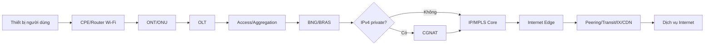

# TÀI LIỆU THÁNG 1  
## Tổng quan hạ tầng ISP/FTEL – IS-IS – BGP – Quy trình vận hành mạng

> **Phạm vi tài liệu:** Tài liệu này được tổng hợp theo mục tiêu tháng đầu trong kế hoạch training: hiểu mô hình FTEL ở mức high-level, học IS-IS, học BGP và làm quen quy trình vận hành thực tế.  
> **Lưu ý quan trọng:** Sơ đồ và ví dụ trong tài liệu là **mô hình ISP tham chiếu**, không phải sơ đồ nội bộ chính thức của FPT Telecom. Topology thật, quy hoạch IP, community BGP, chính sách định tuyến, tiêu chuẩn đặt tên và SOP nội bộ phải được xác nhận với mentor.

---

# MỤC LỤC

1. Mục tiêu cần đạt trong tháng đầu  
2. Mô hình tổng quan của một hạ tầng ISP/FTTH  
3. Luồng thuê bao từ khách hàng tới Internet và dịch vụ nội bộ  
4. Các thuật ngữ POP, P, PE, BRAS/BNG, CGNAT, IX, CDN  
5. Kiến thức nền bắt buộc trước khi học IS-IS và BGP  
6. Toàn bộ lý thuyết trọng tâm về IS-IS  
7. Toàn bộ lý thuyết trọng tâm về BGP  
8. Cách IS-IS và BGP phối hợp trong mạng ISP  
9. Tổng quan MPLS và MP-BGP liên quan tới công việc  
10. Monitoring và troubleshooting  
11. Quy trình vận hành mạng thực tế  
12. Kế hoạch học và sản phẩm cần hoàn thành theo từng tuần  
13. Bộ câu hỏi tự kiểm tra  
14. Các câu hỏi nên hỏi mentor  
15. Tài liệu tham khảo chính thức

---

# 1. MỤC TIÊU CẦN ĐẠT TRONG THÁNG ĐẦU

Sau tháng đầu, cần đạt được bốn nhóm năng lực sau.

## 1.1. Hiểu mô hình mạng ISP ở mức high-level

Cần tự vẽ được luồng:

```text
Khách hàng
   |
CPE/Router Wi-Fi
   |
ONT/ONU
   |
OLT/Access Node
   |
Access/Aggregation Network
   |
BNG/BRAS ---- AAA/RADIUS
   |
CGNAT (nếu thuê bao dùng IPv4 private)
   |
IP/MPLS Core
   |
Internet Edge / Peering / Transit / CDN / Data Center
   |
Dịch vụ Internet hoặc dịch vụ nội bộ
```

Không chỉ nhớ tên thiết bị, mà phải trả lời được:

- Thiết bị đó nằm ở lớp nào?
- Nó xử lý Layer 2 hay Layer 3?
- Nó chạy giao thức nào?
- Nó giữ trạng thái thuê bao hay chỉ chuyển tiếp gói tin?
- Khi thiết bị hoặc đường truyền lỗi, khách hàng gặp hiện tượng gì?
- Nhóm nào chịu trách nhiệm xử lý?

## 1.2. Hiểu IS-IS

Cần giải thích được:

- IS-IS là IGP link-state.
- Router tạo adjacency như thế nào.
- LSP, LSDB, SPF hoạt động ra sao.
- Level 1, Level 2 và Level 1-2 khác nhau thế nào.
- NET address gồm những phần nào.
- DIS và pseudonode dùng để làm gì.
- Vì sao mạng ISP thường dùng IS-IS trong core.
- IS-IS hỗ trợ MPLS, IPv6 và Traffic Engineering như thế nào.
- Cách cấu hình, kiểm tra và xử lý lỗi IS-IS trên Junos.

## 1.3. Hiểu BGP

Cần giải thích được:

- AS và ASN là gì.
- eBGP và iBGP khác nhau thế nào.
- BGP sử dụng TCP port 179.
- BGP FSM gồm những trạng thái nào.
- Các path attribute quan trọng.
- Cách BGP chọn best path.
- Routing policy quyết định inbound/outbound route như thế nào.
- Vì sao cần Route Reflector.
- MP-BGP dùng để mang IPv6, VPN và EVPN route như thế nào.
- Cách cấu hình, kiểm tra và xử lý lỗi BGP trên Junos.

## 1.4. Hiểu cách vận hành thực tế

Cần nắm được:

- Ticket, incident, change và maintenance window.
- Pre-check, implementation, post-check và rollback.
- Quy trình đấu nối và nghiệm thu kênh.
- Quy trình xuất/nhập vật tư và bàn giao.
- Cách đọc alarm và phân loại sự cố.
- Cách ghi timeline, bằng chứng, ảnh chụp và log.
- Khi nào tự xử lý, khi nào phải escalation.
- Không thay đổi mạng production khi chưa có phê duyệt.

---

# 2. MÔ HÌNH TỔNG QUAN CỦA MỘT HẠ TẦNG ISP/FTTH

## 2.1. Ba mặt phẳng trong mạng

### Data plane

Data plane thực hiện chuyển tiếp gói tin thật của khách hàng.

Ví dụ:

- Chuyển frame Ethernet.
- Lookup bảng FIB.
- Gắn hoặc tháo MPLS label.
- NAT địa chỉ và port.
- Policing, shaping và QoS.

### Control plane

Control plane học và tính toán đường đi.

Ví dụ:

- IS-IS xây dựng topology nội bộ.
- BGP trao đổi prefix và policy.
- LDP/RSVP/SR phân phối thông tin label.
- ARP/ND tìm địa chỉ Layer 2 của next-hop.
- BFD phát hiện lỗi nhanh.

### Management plane

Management plane phục vụ vận hành.

Ví dụ:

- SSH, NETCONF.
- SNMP, telemetry.
- Syslog.
- NTP.
- TACACS+/RADIUS dành cho tài khoản quản trị.
- Backup cấu hình.
- NMS, monitoring dashboard và ticketing.

Một sự cố có thể chỉ ảnh hưởng một mặt phẳng. Ví dụ BGP session vẫn Established nhưng data plane không forward được do next-hop hoặc FIB lỗi.

---

## 2.2. Các lớp chính trong mạng ISP

### Lớp truy nhập – Access

Đây là lớp gần khách hàng nhất.

Thành phần thường gặp:

- CPE hoặc Residential Gateway.
- ONT/ONU.
- OLT.
- Access switch.
- Splitter quang.
- Hệ thống cáp quang thuê bao.

Nhiệm vụ chính:

- Đưa kết nối vật lý từ khách hàng vào mạng nhà cung cấp.
- Gắn VLAN hoặc thông tin nhận dạng thuê bao.
- Chuyển lưu lượng về aggregation hoặc BNG.
- Áp dụng một phần QoS, anti-spoofing và bảo vệ Layer 2.

### Lớp tập trung – Aggregation/Metro

Nhiệm vụ:

- Gom lưu lượng của nhiều access node.
- Tạo dự phòng đường truyền.
- Vận chuyển VLAN, QinQ hoặc MPLS.
- Đưa lưu lượng thuê bao về BNG/BRAS.
- Kết nối các POP trong thành phố hoặc khu vực.

Thiết bị có thể là:

- Aggregation switch.
- Metro Ethernet router.
- PE router.
- MPLS aggregation router.

### Lớp IP/MPLS Core

Nhiệm vụ:

- Vận chuyển lưu lượng giữa các POP, vùng, data center và Internet edge.
- Cung cấp underlay ổn định.
- Chuyển tiếp MPLS label.
- Hỗ trợ L3VPN, L2VPN, EVPN và các dịch vụ khác.

Các vai trò thường gặp:

- **P router:** router lõi, chủ yếu chuyển tiếp MPLS, thường không giữ route khách hàng VPN.
- **PE router:** nằm ở biên mạng MPLS, kết nối CE, BNG, dịch vụ hoặc mạng ngoài.
- **Route Reflector:** phân phối route BGP trong AS, thường không trực tiếp forward traffic.

### Lớp dịch vụ thuê bao

Thành phần:

- BNG/BRAS.
- RADIUS/AAA.
- DHCP.
- DNS.
- Policy server.
- CGNAT.
- Subscriber management platform.

Nhiệm vụ:

- Xác thực thuê bao.
- Cấp địa chỉ IP.
- Gán profile tốc độ và dịch vụ.
- Accounting.
- Áp dụng policy.
- Kết thúc PPPoE hoặc IPoE session.
- Chuyển lưu lượng thuê bao sang core và Internet.

### Lớp Internet Edge

Nhiệm vụ:

- eBGP với upstream/transit.
- Peering với ISP, CDN, cloud hoặc content provider.
- Kết nối Internet Exchange.
- Lọc route.
- Điều khiển inbound/outbound traffic.
- Chống route leak và prefix hijack.
- DDoS mitigation hoặc RTBH/FlowSpec tùy kiến trúc.

### Data Center và Service Edge

Có thể chứa:

- DNS resolver.
- CDN/cache.
- IPTV platform.
- Voice platform.
- Portal.
- AAA/RADIUS.
- Monitoring.
- Cloud/private cloud.
- Dịch vụ nội bộ doanh nghiệp.

---

# 3. LUỒNG THUÊ BAO TỪ KHÁCH HÀNG TỚI DỊCH VỤ

## 3.1. Luồng Internet cơ bản



## 3.2. Trình tự logic khi thuê bao truy cập

1. ONT đồng bộ với OLT.
2. Access network chuyển traffic của thuê bao về BNG.
3. Thuê bao thiết lập PPPoE hoặc IPoE/DHCP session.
4. BNG liên hệ AAA/RADIUS để xác thực và lấy profile.
5. Thuê bao được cấp IPv4, IPv6 hoặc cả hai.
6. BNG cài route/session và áp QoS/policy.
7. Nếu dùng IPv4 private, lưu lượng có thể đi qua CGNAT.
8. Core sử dụng IGP/MPLS để đưa packet tới Internet edge hoặc service edge.
9. Internet edge sử dụng BGP để chọn đường đi ra ngoài AS.
10. Gói trả về đi theo BGP, core và subscriber route để trở lại thuê bao.

## 3.3. Luồng tới CDN hoặc dịch vụ nội bộ

Nếu nội dung đã được cache hoặc đặt server gần người dùng:

```text
Khách hàng → Access → BNG → Core/Metro → CDN nội mạng → Khách hàng
```

Lợi ích:

- Giảm băng thông quốc tế.
- Giảm latency.
- Tăng tốc tải nội dung.
- Giảm phụ thuộc upstream.

## 3.4. Luồng tới mạng doanh nghiệp/L3VPN

```text
Chi nhánh A CE
      |
     PE1
      |
   MPLS Core
      |
     PE2
      |
Chi nhánh B CE
```

- IS-IS cung cấp reachability giữa loopback của PE/P.
- MPLS cung cấp label transport.
- MP-BGP trao đổi VPN route giữa PE.
- Route Distinguisher làm route VPN trở nên duy nhất.
- Route Target điều khiển import/export giữa các VRF.

---

# 4. THUẬT NGỮ QUAN TRỌNG

| Thuật ngữ | Ý nghĩa | Vai trò |
|---|---|---|
| KHG | Khách hàng | Điểm bắt đầu hoặc kết thúc dịch vụ |
| POP | Point of Presence | Điểm đặt thiết bị mạng tại một khu vực |
| CPE | Customer Premises Equipment | Thiết bị tại phía khách hàng |
| ONT/ONU | Optical Network Terminal/Unit | Kết cuối đường quang PON |
| OLT | Optical Line Terminal | Thiết bị tập trung nhiều ONT/ONU |
| Access | Mạng truy nhập | Đưa thuê bao vào hạ tầng nhà mạng |
| Aggregation | Mạng tập trung | Gom traffic từ nhiều access node |
| P router | Provider/Core router | Chuyển tiếp trong MPLS core |
| PE router | Provider Edge | Biên MPLS, kết nối dịch vụ/khách hàng |
| CE router | Customer Edge | Router phía khách hàng doanh nghiệp |
| BRAS | Broadband Remote Access Server | Thuật ngữ truyền thống cho thiết bị kết cuối broadband |
| BNG | Broadband Network Gateway | Tên hiện đại hơn của broadband edge |
| AAA | Authentication, Authorization, Accounting | Xác thực, phân quyền và ghi nhận sử dụng |
| RADIUS | Giao thức AAA | Trao đổi thông tin thuê bao và policy |
| CGNAT | Carrier-Grade NAT | Cho nhiều thuê bao dùng chung IPv4 public |
| CDN | Content Delivery Network | Đặt nội dung gần người dùng |
| IX/IXP | Internet Exchange Point | Nơi nhiều AS trao đổi traffic |
| Transit | Dịch vụ trung chuyển Internet | Mua khả năng đi tới toàn Internet |
| Peering | Kết nối trao đổi traffic trực tiếp | Giảm transit, latency và tăng dự phòng |
| IGP | Interior Gateway Protocol | Định tuyến trong một AS |
| EGP | Exterior Gateway Protocol | Định tuyến giữa các AS |
| RIB | Routing Information Base | Bảng route logic của control plane |
| FIB | Forwarding Information Base | Bảng dùng để forward packet |
| LSDB | Link-State Database | Cơ sở dữ liệu topology của link-state IGP |
| RR | Route Reflector | Giảm full-mesh iBGP |
| LSP | Có hai nghĩa tùy ngữ cảnh | IS-IS Link-State PDU hoặc MPLS Label-Switched Path |

> Khi đọc tài liệu cần xác định rõ từ **LSP** đang nói tới IS-IS Link-State PDU hay MPLS Label-Switched Path.

---

# 5. KIẾN THỨC NỀN BẮT BUỘC

Trước khi đi sâu vào IS-IS và BGP, cần chắc các phần sau:

## 5.1. IPv4 và IPv6

- Network address, host address.
- Prefix length.
- Subnetting.
- Longest-prefix match.
- Default route.
- Loopback /32 và /128.
- Link-local IPv6.
- Neighbor Discovery.

## 5.2. Routing table

Một route thường gồm:

- Prefix.
- Protocol học route.
- Preference/administrative distance.
- Metric.
- Next-hop.
- Interface.
- Trạng thái active/inactive/hidden.

Trên Junos:

```bash
show route
show route protocol isis
show route protocol bgp
show route <prefix> extensive
show route forwarding-table
```

## 5.3. Recursive next-hop

BGP route thường có next-hop là loopback hoặc địa chỉ ở xa. Router phải dùng IGP để tìm đường tới next-hop đó.

Ví dụ:

```text
BGP route: 203.0.113.0/24 via 10.255.0.2
IS-IS route: 10.255.0.2/32 via ge-0/0/0.0
```

Nếu IS-IS mất route tới `10.255.0.2`, BGP route có thể trở thành unusable dù BGP session vẫn còn.

## 5.4. ECMP

Equal-Cost Multi-Path cho phép nhiều đường có cùng cost được cài vào forwarding table. Cần phân biệt:

- IS-IS ECMP.
- BGP multipath.
- Per-flow load balancing.
- Per-packet load balancing.

## 5.5. MTU

MTU mismatch có thể gây:

- Ping gói nhỏ được nhưng traffic lớn lỗi.
- MPLS packet bị drop.
- IS-IS adjacency hoặc BGP TCP gặp hành vi bất thường tùy thiết kế.
- PMTUD thất bại nếu ICMP bị chặn.

---

# 6. TOÀN BỘ LÝ THUYẾT TRỌNG TÂM VỀ IS-IS

# 6.1. IS-IS là gì?

IS-IS là một Interior Gateway Protocol dạng link-state. Mỗi router quảng bá trạng thái liên kết của mình, xây dựng LSDB và chạy thuật toán SPF/Dijkstra để tính đường ngắn nhất.

Vai trò phổ biến trong ISP:

- Học reachability giữa loopback router.
- Học các infrastructure prefix.
- Làm underlay cho MPLS.
- Cung cấp topology cho LDP, RSVP-TE hoặc Segment Routing.
- Hội tụ nhanh khi link/node lỗi.
- Không mang toàn bộ route Internet trong IGP.

## 6.2. Vì sao ISP thường dùng IS-IS?

Các lý do thường gặp:

- Thiết kế link-state phù hợp mạng core.
- Hoạt động trực tiếp trên Layer 2 CLNS thay vì phụ thuộc IP để tạo adjacency.
- TLV dễ mở rộng.
- Hỗ trợ IPv4, IPv6, Traffic Engineering, MPLS và Segment Routing.
- Phân cấp Level 1/Level 2.
- Có thể thiết kế single Level 2 domain tương đối đơn giản.
- Phù hợp với core có nhiều router và yêu cầu hội tụ nhanh.

Không nên hiểu rằng IS-IS luôn tốt hơn OSPF. Lựa chọn còn phụ thuộc lịch sử mạng, năng lực đội vận hành, vendor, quy mô và tiêu chuẩn thiết kế.

---

## 6.3. Thuật ngữ OSI trong IS-IS

IS-IS có nguồn gốc từ kiến trúc OSI nên dùng một số thuật ngữ khác với IP.

| Thuật ngữ | Ý nghĩa gần tương đương |
|---|---|
| Intermediate System | Router |
| End System | Host |
| CLNS | Connectionless Network Service |
| CLNP | Giao thức network layer của OSI |
| NSAP | Địa chỉ OSI |
| NET | NSAP dùng để định danh router |

---

## 6.4. Cấu trúc NET address

Ví dụ:

```text
49.0001.0100.0000.0001.00
```

Có thể hiểu:

```text
49.0001 | 0100.0000.0001 | 00
 Area   |    System ID    | NSEL
```

### Area ID

- Xác định area IS-IS.
- Có độ dài linh hoạt.
- `49` thường được dùng cho private addressing.

### System ID

- Thường dài 6 byte.
- Phải duy nhất trong IS-IS domain.
- Có thể lấy từ loopback IPv4 chuyển đổi thành dạng 6 byte hoặc theo quy ước nội bộ.

Ví dụ loopback `10.0.0.1` có thể biểu diễn học thuật thành:

```text
010.000.000.001 → 0100.0000.0001
```

### NSEL

- Thường là `00` đối với NET của router.

### Nguyên tắc vận hành

- Không trùng System ID.
- Không đổi NET tùy tiện trên production.
- Theo đúng quy hoạch area và naming nội bộ.
- NET thường đặt trên `lo0` trong Junos.

---

## 6.5. Level 1, Level 2 và Level 1-2

### Level 1

- Hiểu topology trong cùng area.
- Tạo adjacency L1 với router có area phù hợp.
- Đi tới area khác thông qua router L1/L2 có attached bit.
- Phù hợp cho routing nội vùng.

### Level 2

- Xây dựng backbone giữa các area.
- Tạo adjacency L2 kể cả khi area address khác nhau.
- Biết reachability liên vùng.

### Level 1-2

- Tham gia cả L1 và L2.
- Có LSDB riêng cho từng level.
- Đóng vai trò kết nối area vào L2 backbone.

### Mô hình single Level 2

Nhiều mạng provider triển khai toàn core ở Level 2 để:

- Thiết kế đơn giản.
- Tránh route leaking phức tạp.
- Dễ troubleshooting.

Nhược điểm:

- Một LSDB lớn hơn.
- Cần kiểm soát flooding và scale.

### Mô hình nhiều area

Phù hợp khi:

- Cần giảm LSDB và SPF domain.
- Có phân vùng địa lý hoặc vận hành rõ ràng.
- Đội vận hành đủ khả năng quản lý route leaking và policy.

---

## 6.6. Loại liên kết IS-IS

### Point-to-point

Dùng khi chỉ có hai router trên liên kết.

Đặc điểm:

- Không cần DIS.
- Không tạo pseudonode.
- Topology đơn giản.
- Thường phù hợp cho link router-router.

Trên Ethernet, có thể cấu hình interface IS-IS kiểu point-to-point để tránh cơ chế broadcast LAN.

### Broadcast

Dùng khi nhiều router cùng một LAN.

Đặc điểm:

- Bầu DIS.
- Tạo pseudonode.
- Router gửi LAN IIH.
- Giảm số lượng quan hệ topology từ dạng full mesh logic xuống dạng kết nối qua pseudonode.

---

## 6.7. DIS và pseudonode

DIS là Designated Intermediate System.

Nhiệm vụ:

- Đại diện cho LAN broadcast.
- Tạo pseudonode LSP.
- Gửi CSNP định kỳ trên LAN.

Khác OSPF DR/BDR:

- IS-IS không có BDIS theo đúng nghĩa như OSPF BDR.
- DIS có thể bị thay thế nếu router mới có priority cao hơn.
- Tất cả router trên LAN vẫn hình thành adjacency với nhau.

Pseudonode giúp mô tả LAN như một node logic, tránh mỗi router quảng bá link tới mọi router còn lại.

---

## 6.8. Các loại PDU chính

### IIH – IS-IS Hello

Dùng để:

- Phát hiện neighbor.
- Duy trì adjacency.
- Trao đổi level, area, capability và timer.

Các loại:

- LAN Level 1 IIH.
- LAN Level 2 IIH.
- Point-to-point IIH.

### LSP – Link-State PDU

Chứa:

- Router ID/System ID.
- Sequence number.
- Lifetime.
- Neighbor.
- Prefix.
- Metric.
- Capability.
- TLV/sub-TLV.

LSP được flood trong phạm vi level tương ứng.

### CSNP – Complete Sequence Number PDU

Là bản tóm tắt toàn bộ LSP trong LSDB.

Dùng để:

- So sánh LSDB.
- Phát hiện LSP thiếu hoặc cũ.
- Đồng bộ database.

### PSNP – Partial Sequence Number PDU

Dùng để:

- Yêu cầu LSP cụ thể.
- Acknowledge LSP tùy loại link.
- Báo những phần LSDB đang thiếu.

---

## 6.9. Quá trình hình thành adjacency

Luồng đơn giản:

1. Interface vật lý và logical up.
2. Interface có `family iso`.
3. Interface được khai báo dưới `protocols isis`.
4. Router gửi IIH.
5. Hai bên kiểm tra level, area và thông số tương thích.
6. Adjacency chuyển sang Up.
7. Hai bên đồng bộ LSDB bằng LSP/CSNP/PSNP.
8. SPF chạy và route được đưa vào RIB.

Những điều thường làm adjacency không lên:

- Interface chưa có `family iso`.
- Chưa add interface vào IS-IS.
- Level mismatch.
- Area mismatch với adjacency L1.
- Authentication mismatch.
- MTU hoặc link lỗi.
- Interface passive.
- Duplicate System ID.
- Firewall/filter chặn CLNS.
- SRX chưa bật packet-based forwarding cho family ISO trong trường hợp cần thiết.

---

## 6.10. Link-state database và SPF

Mỗi router trong cùng flooding domain cần có LSDB nhất quán.

Khi topology thay đổi:

1. Router phát hiện link up/down.
2. Router tạo LSP mới với sequence number cao hơn.
3. LSP được flood.
4. Router nhận LSP, cập nhật LSDB.
5. SPF được chạy.
6. Route mới được chọn.
7. RIB/FIB được cập nhật.

Tổng thời gian hội tụ phụ thuộc:

- Thời gian phát hiện lỗi.
- Hello/hold timer.
- BFD.
- Thời gian tạo và flood LSP.
- SPF delay/throttling.
- RIB/FIB programming.
- MPLS/LDP/BGP phụ thuộc phía trên.

---

## 6.11. Metric

IS-IS dùng metric để tính shortest path.

### Narrow metric

- Kiểu cũ.
- Không phù hợp cho nhiều thiết kế hiện đại.

### Wide metric

- Không gian metric lớn hơn.
- Hỗ trợ Traffic Engineering và extension hiện đại tốt hơn.
- Thường được dùng trong mạng provider.

Nguyên tắc quy hoạch metric:

- Link chính có cost thấp hơn link dự phòng.
- Tránh đặt metric ngẫu nhiên.
- Cần tài liệu hóa mục đích traffic engineering.
- Kiểm tra cả chiều đi và chiều về.

---

## 6.12. TLV và khả năng mở rộng

IS-IS mang thông tin bằng TLV:

```text
Type | Length | Value
```

Nhờ TLV, giao thức có thể bổ sung capability mà không cần thay đổi toàn bộ cấu trúc PDU.

Ví dụ thông tin được mang:

- IPv4 reachability.
- IPv6 reachability.
- Extended neighbor.
- Traffic Engineering.
- Router capability.
- Segment Routing SID.
- Authentication.

Đây là một trong các lý do IS-IS phù hợp với hạ tầng provider phát triển lâu dài.

---

## 6.13. Attached bit

Router L1/L2 có kết nối tới L2 backbone có thể đặt attached bit trong L1 LSP.

Router L1 dùng thông tin này để:

- Chọn router L1/L2 gần nhất.
- Gửi traffic đi ngoài area về router đó.

Nếu thiết kế hoặc state attached bit sai, traffic liên vùng có thể blackhole hoặc đi đường không mong muốn.

---

## 6.14. Overload bit

Khi overload bit được đặt, router báo rằng không nên dùng nó làm transit router, nhưng vẫn có thể reachable tới chính các prefix của nó tùy chính sách và implementation.

Ứng dụng:

- Router mới khởi động, LSDB/BGP/FIB chưa hội tụ hoàn toàn.
- Router đang bảo trì.
- Router thiếu tài nguyên.
- Cần drain traffic trước change.

Overload bit rất hữu ích trong vận hành core vì giúp tránh đưa traffic transit qua router chưa sẵn sàng.

---

## 6.15. Passive interface

Passive interface:

- Quảng bá prefix vào IS-IS.
- Không gửi hello và không tạo adjacency trên interface đó.

Loopback thường được cấu hình passive vì:

- Cần quảng bá loopback.
- Không có neighbor trên loopback.
- Tránh xử lý hello không cần thiết.

Ví dụ Junos:

```bash
set protocols isis interface lo0.0 passive
```

---

## 6.16. Authentication

Có thể xác thực:

- Hello.
- LSP.
- Theo level.

Mục tiêu:

- Ngăn thiết bị không hợp lệ tạo adjacency.
- Ngăn LSP giả mạo.
- Giảm nguy cơ phá topology.

Yêu cầu vận hành:

- Key hai bên phải khớp.
- Có quy trình thay key.
- Không để plain-text password trong tài liệu chia sẻ.
- Kiểm tra thời điểm đổi key và rollback.

---

## 6.17. IPv6 trong IS-IS

IS-IS có thể quảng bá cả IPv4 và IPv6.

Hai hướng triển khai thường gặp:

### Single topology

IPv4 và IPv6 dùng cùng topology.

Ưu điểm:

- Đơn giản.

Rủi ro:

- Các interface trong topology cần hỗ trợ hai address family phù hợp.

### Multi-topology

IPv4 và IPv6 có thể có topology logic khác nhau.

Dùng khi:

- Khả năng IPv4/IPv6 trên link không đồng nhất.
- Cần chính sách topology khác nhau.

---

## 6.18. IS-IS và MPLS

IS-IS thường cung cấp underlay cho MPLS:

```text
IS-IS → biết đường tới loopback router
LDP/RSVP/SR → tạo label path dựa trên topology
MP-BGP → phân phối route dịch vụ/VPN
```

Nếu IS-IS lỗi:

- LDP session có thể mất.
- MPLS LSP có thể down.
- BGP next-hop không resolve.
- VPN route có thể hidden hoặc unusable.
- Nhiều dịch vụ cùng bị ảnh hưởng.

Vì vậy khi troubleshooting MPLS, phải kiểm tra từ dưới lên:

```text
Physical → Interface/IP → IS-IS → MPLS/LDP/RSVP → MP-BGP → VPN/Service
```

---

## 6.19. Cấu hình IS-IS Junos cơ bản

### Router R1

```bash
set interfaces ge-0/0/0 unit 0 description "TO-R2"
set interfaces ge-0/0/0 unit 0 family inet address 10.0.12.1/30
set interfaces ge-0/0/0 unit 0 family iso

set interfaces lo0 unit 0 family inet address 10.255.0.1/32
set interfaces lo0 unit 0 family iso address 49.0001.0102.5500.0001.00

set protocols isis level 1 disable
set protocols isis level 2 wide-metrics-only
set protocols isis interface ge-0/0/0.0 point-to-point
set protocols isis interface lo0.0 passive
```

### Router R2

```bash
set interfaces ge-0/0/0 unit 0 description "TO-R1"
set interfaces ge-0/0/0 unit 0 family inet address 10.0.12.2/30
set interfaces ge-0/0/0 unit 0 family iso

set interfaces lo0 unit 0 family inet address 10.255.0.2/32
set interfaces lo0 unit 0 family iso address 49.0001.0102.5500.0002.00

set protocols isis level 1 disable
set protocols isis level 2 wide-metrics-only
set protocols isis interface ge-0/0/0.0 point-to-point
set protocols isis interface lo0.0 passive
```

### Kiểm tra trước commit

```bash
show | compare
commit check
commit confirmed 5
```

Sau khi kiểm tra ổn:

```bash
commit
```

---

## 6.20. Lệnh kiểm tra IS-IS

```bash
show isis adjacency
show isis adjacency extensive
show isis interface
show isis interface extensive
show isis database
show isis database extensive
show isis route
show route protocol isis
show route <loopback> extensive
show interfaces terse
show interfaces <interface> extensive
show configuration protocols isis | display set
show log messages | match ISIS
```

### Ý nghĩa thứ tự kiểm tra

1. Interface có up không?
2. `family iso` có chưa?
3. IS-IS interface có được enable không?
4. Adjacency có Up không?
5. LSDB có LSP của neighbor không?
6. Route loopback có được cài không?
7. FIB có next-hop đúng không?
8. Ping loopback bằng source loopback.
9. Kiểm tra MPLS/BGP phía trên.

---

## 6.21. Checklist troubleshooting IS-IS

### Trường hợp adjacency Down

```text
[ ] Interface physical up?
[ ] Logical unit up?
[ ] family iso configured?
[ ] Interface added under protocols isis?
[ ] Level compatible?
[ ] Area compatible for L1?
[ ] Authentication matches?
[ ] Point-to-point/broadcast mode compatible?
[ ] MTU and encapsulation correct?
[ ] Duplicate System ID?
[ ] Filter/security policy blocking CLNS?
[ ] Log có lỗi gì?
```

### Trường hợp adjacency Up nhưng không có route

```text
[ ] LSDB có prefix cần tìm?
[ ] Prefix có được advertise?
[ ] Loopback passive đúng chưa?
[ ] Metric có quá lớn hoặc route bị preference khác ghi đè?
[ ] Route bị hidden?
[ ] Level/route leaking đúng chưa?
[ ] Có overload bit hoặc policy đặc biệt?
```

### Trường hợp traffic đi sai đường

```text
[ ] So sánh metric hai chiều.
[ ] Kiểm tra ECMP.
[ ] Kiểm tra topology thực tế.
[ ] Kiểm tra interface bandwidth/cost.
[ ] Kiểm tra LSP mới/cũ và sequence.
[ ] Kiểm tra MPLS explicit path hoặc policy phía trên.
```

---

# 7. TOÀN BỘ LÝ THUYẾT TRỌNG TÂM VỀ BGP

# 7.1. BGP là gì?

BGP là giao thức path-vector dùng để trao đổi thông tin reachability giữa các Autonomous System và cũng được dùng bên trong một AS để phân phối route quy mô lớn.

BGP được dùng cho:

- Internet routing.
- Kết nối upstream/transit.
- Peering.
- Kết nối khách hàng có ASN.
- Phân phối route Internet trong ISP.
- L3VPN, L2VPN và EVPN qua MP-BGP.
- Điều khiển đường đi bằng policy.

BGP không chỉ tìm đường ngắn nhất. Nó ưu tiên **chính sách quản trị**.

---

## 7.2. Autonomous System và ASN

Autonomous System là một miền mạng:

- Thuộc một cơ quan quản trị kỹ thuật.
- Có chính sách định tuyến thống nhất ra bên ngoài.
- Được nhận diện bởi ASN.

ASN có:

- Dạng 2 byte truyền thống.
- Dạng 4 byte hiện đại.

Private ASN thường dùng trong lab hoặc mạng riêng. Không quảng bá private ASN ra Internet trừ khi có cơ chế xử lý phù hợp.

Theo dữ liệu interconnection công khai trên PeeringDB tại thời điểm biên soạn, FPT Telecom được liệt kê với **AS18403**. Đây chỉ là dữ liệu public; topology, policy và hệ thống nội bộ không thể suy ra đầy đủ từ ASN.

---

## 7.3. eBGP và iBGP

### eBGP

- Hai peer thuộc hai AS khác nhau.
- Thường dùng tại Internet edge, khách hàng, upstream và peering.
- Mặc định thường kết nối trực tiếp, nhưng có thể multihop.
- Khi quảng bá route sang AS khác, AS_PATH được cập nhật.

### iBGP

- Hai peer cùng AS.
- Dùng để phân phối route BGP bên trong ISP.
- Thường peer bằng loopback.
- Dựa vào IGP để resolve địa chỉ peer và BGP next-hop.
- Route học từ một iBGP peer không tự động quảng bá sang iBGP peer khác, trừ khi dùng full mesh, Route Reflector hoặc confederation.

---

## 7.4. BGP dùng TCP port 179

BGP chạy trên TCP:

- Một phía mở kết nối tới TCP port 179.
- TCP đảm bảo sequencing, retransmission và reliability.
- BGP không cần tự xây cơ chế retransmit toàn bộ update như một số giao thức khác.

Điều kiện để session lên:

- IP reachability hai chiều.
- TCP 179 không bị chặn.
- ASN đúng.
- Source/local-address đúng.
- Authentication đúng nếu dùng.
- TTL phù hợp.
- Address family tương thích.
- Không có cấu hình duplicate hoặc policy gây reset.

---

## 7.5. BGP Finite State Machine

Các trạng thái chính:

### Idle

- Khởi tạo.
- Chưa thiết lập TCP.

### Connect

- Đang chờ TCP hoàn tất.

### Active

- TCP chưa thành công và BGP tiếp tục thử.
- Tên “Active” không có nghĩa session đã hoạt động.

### OpenSent

- Đã gửi OPEN.
- Đang chờ OPEN của peer.

### OpenConfirm

- OPEN hợp lệ.
- Đang chờ KEEPALIVE.

### Established

- Session hoạt động.
- Có thể trao đổi UPDATE.

### Cách đọc nhanh

- **Idle:** kiểm tra cấu hình, disabled, damping hoặc lỗi nghiêm trọng.
- **Active/Connect:** kiểm tra reachability, TCP 179, source address và firewall.
- **OpenSent/OpenConfirm:** kiểm tra ASN, capability, authentication và parameter.
- **Established nhưng không có route:** kiểm tra policy, address family và prefix advertisement.

---

## 7.6. Các loại message BGP

### OPEN

Chứa:

- BGP version.
- Local ASN.
- Hold time.
- BGP Identifier.
- Optional parameters/capabilities.

### UPDATE

Dùng để:

- Quảng bá NLRI.
- Withdraw route.
- Mang path attributes.

### KEEPALIVE

- Duy trì session.
- Không mang route.

### NOTIFICATION

- Báo lỗi.
- Thường làm session đóng.

### ROUTE-REFRESH

- Yêu cầu peer gửi lại route cho address family.
- Giúp áp policy mới mà không nhất thiết hard reset session.

---

## 7.7. NLRI

NLRI mô tả prefix có thể tới được.

Ví dụ:

```text
203.0.113.0/24
2001:db8:100::/48
```

Trong MP-BGP, NLRI còn có thể biểu diễn:

- VPNv4.
- VPNv6.
- EVPN.
- Labeled unicast.
- FlowSpec.
- Các address family khác.

---

## 7.8. Path attributes quan trọng

## ORIGIN

Cho biết nguồn gốc route:

- `IGP` – mã thấp nhất.
- `EGP`.
- `Incomplete` – thường do redistribute.

Trong best-path, origin thấp hơn thường được ưu tiên.

## AS_PATH

Danh sách AS route đã đi qua.

Công dụng:

- Chống loop: router không nhận route chứa ASN của chính mình, trừ trường hợp cấu hình đặc biệt.
- Best-path thường ưu tiên AS_PATH ngắn hơn.
- Có thể prepend để làm đường kém hấp dẫn hơn từ bên ngoài.

## NEXT_HOP

Địa chỉ next-hop để tới prefix.

Điểm rất quan trọng:

- iBGP thường giữ nguyên next-hop học từ eBGP.
- Router iBGP khác phải có IGP route tới next-hop đó.
- Có thể cần `next-hop self` tùy thiết kế.

## LOCAL_PREF

- Dùng trong nội bộ AS.
- Giá trị cao hơn được ưu tiên.
- Không quảng bá sang eBGP thông thường.
- Là công cụ chính để điều khiển đường ra khỏi AS.

Ví dụ chính sách phổ biến:

```text
Customer route  → local-pref cao
Peer route      → local-pref trung bình
Transit route   → local-pref thấp
```

Con số cụ thể phụ thuộc chính sách nhà mạng.

## MED

- Gợi ý cho AS láng giềng chọn điểm vào.
- Giá trị thấp hơn được ưu tiên.
- Thường chỉ so sánh giữa route đến từ cùng neighboring AS theo hành vi mặc định.
- Không nên coi MED là mệnh lệnh bắt buộc cho AS khác.

## COMMUNITY

Cho phép gắn nhãn logic cho route.

Ứng dụng:

- Nhận biết route từ customer, peer, transit.
- Điều khiển local-pref.
- Không quảng bá route tới một nhóm peer.
- Blackhole.
- Điều khiển prepend.
- Phân loại khu vực hoặc dịch vụ.

Các well-known community thường gặp:

- `no-export`.
- `no-advertise`.
- `no-export-subconfed`.
- `no-peer` tùy hỗ trợ/chính sách.

## LARGE COMMUNITY

Dạng ba số 32-bit:

```text
GlobalAdministrator:LocalData1:LocalData2
```

Ưu điểm:

- Phù hợp ASN 4 byte.
- Có cấu trúc rõ ràng.
- Dễ xây chính sách lớn.

## ORIGINATOR_ID và CLUSTER_LIST

Dùng trong Route Reflector để:

- Chống loop.
- Xác định nguồn gốc route.
- Ghi lại cluster đã đi qua.

---

## 7.9. BGP best-path trên Junos

Thứ tự dưới đây là dạng rút gọn phục vụ học và troubleshooting. Cần đọc tài liệu đúng phiên bản Junos khi xử lý production.

1. Next-hop phải resolve được.
2. So sánh route preference của protocol.
3. LOCAL_PREF cao hơn.
4. AIGP thấp hơn nếu được dùng.
5. AS_PATH ngắn hơn.
6. ORIGIN thấp hơn: IGP < EGP < Incomplete.
7. MED thấp hơn theo điều kiện so sánh.
8. Ưu tiên route nội bộ/local theo bước xử lý của Junos.
9. eBGP thường được ưu tiên hơn route external học qua iBGP.
10. IGP cost tới BGP next-hop thấp hơn.
11. Với các đường eBGP còn hòa, có thể ưu tiên route cũ hơn để giảm flap.
12. Router ID thấp hơn.
13. Cluster list ngắn hơn.
14. Peer IP thấp hơn.

### Ghi nhớ

```text
Reachable next-hop
→ Local Preference
→ AS Path
→ Origin
→ MED
→ eBGP/iBGP
→ IGP cost
→ tie-break
```

### Không được nhầm

- **LOCAL_PREF cao hơn tốt hơn.**
- **MED thấp hơn tốt hơn.**
- **AS_PATH ngắn hơn thường tốt hơn.**
- **IGP metric tới NEXT_HOP thấp hơn tốt hơn.**

---

## 7.10. iBGP full mesh

Theo quy tắc iBGP thông thường, route học từ iBGP không quảng bá sang iBGP peer khác.

Do đó, nếu không có RR/confederation, tất cả iBGP speaker phải full mesh.

Số session:

```text
n × (n - 1) / 2
```

Ví dụ 100 router:

```text
100 × 99 / 2 = 4.950 session
```

Điều này khó mở rộng nên ISP thường dùng Route Reflector.

---

## 7.11. Route Reflector

Các thành phần:

- Route Reflector.
- RR client.
- Non-client.
- Cluster ID.

Quy tắc khái quát:

- Route từ client có thể được reflect tới client khác và non-client.
- Route từ non-client thường được reflect tới client, không reflect tới non-client khác.
- ORIGINATOR_ID và CLUSTER_LIST chống loop.

### Thiết kế RR tốt

- Có ít nhất hai RR để dự phòng.
- RR session dùng loopback.
- IGP phải bảo đảm reachability.
- RR không nhất thiết nằm trên data path.
- Cần xem xét vị trí topology để tránh chọn best-path không tối ưu.
- Với mạng lớn có thể dùng hierarchy hoặc Optimal Route Reflection.

### RR không giải quyết mọi vấn đề

RR giảm số session nhưng có thể:

- Chỉ phản chiếu best path của chính RR.
- Che khuất đường thay thế.
- Dẫn tới path không tối ưu từ góc nhìn client.
- Cần Add-Path, ORR hoặc thiết kế cluster phù hợp trong một số mạng.

---

## 7.12. MP-BGP

MP-BGP mở rộng BGP để mang nhiều address family.

Ví dụ:

| Address family | Mục đích |
|---|---|
| inet unicast | IPv4 unicast |
| inet6 unicast | IPv6 unicast |
| inet-vpn unicast | VPNv4 |
| inet6-vpn unicast | VPNv6 |
| l2vpn signaling | Một số dịch vụ L2VPN/VPLS |
| evpn signaling | EVPN |
| inet flow | IPv4 FlowSpec |
| inet6 flow | IPv6 FlowSpec |

Hai attribute quan trọng:

- `MP_REACH_NLRI`.
- `MP_UNREACH_NLRI`.

---

## 7.13. Routing policy

BGP trên Junos phụ thuộc mạnh vào policy.

Policy có thể:

- Accept hoặc reject route.
- Match prefix.
- Match protocol.
- Match AS path.
- Match community.
- Đổi local-preference.
- Đổi MED.
- Gắn/xóa community.
- Prepend AS path.
- Đổi next-hop.
- Điều khiển quảng bá.

### Import policy

Áp lên route nhận từ peer trước khi route được chấp nhận vào BGP/RIB theo quy trình của Junos.

Dùng để:

- Lọc prefix không hợp lệ.
- Đặt local-pref.
- Gắn community nguồn.
- Chặn default hoặc full route không mong muốn.
- Giới hạn route khách hàng chỉ được quảng bá prefix đã đăng ký.

### Export policy

Áp lên route chuẩn bị quảng bá ra peer.

Dùng để:

- Chỉ quảng bá prefix của chính mạng.
- Không leak route từ peer này sang peer khác.
- Prepend.
- Gắn community.
- Quảng bá default route cho khách hàng.

---

## 7.14. Quan hệ customer – peer – transit

Một chính sách kinh tế phổ biến là valley-free:

- Route từ customer có thể quảng bá cho customer, peer và transit.
- Route từ peer thường chỉ quảng bá cho customer.
- Route từ transit thường chỉ quảng bá cho customer.
- Không quảng bá route học từ peer sang peer khác.
- Không quảng bá route học từ transit sang transit khác nếu không có chủ đích cung cấp transit.

Lý do:

- Tránh trở thành transit miễn phí.
- Tránh route leak.
- Phù hợp quan hệ thương mại.

---

## 7.15. Điều khiển outbound traffic

Outbound là traffic từ AS của mình đi ra ngoài.

Công cụ chính:

- LOCAL_PREF.
- Weight nếu vendor có khái niệm riêng, nhưng Junos tập trung policy/local-pref.
- IGP cost tới next-hop.
- BGP multipath.
- Policy theo prefix/community.

Thông thường LOCAL_PREF là công cụ mạnh nhất trong nội bộ AS.

---

## 7.16. Điều khiển inbound traffic

Inbound là traffic từ Internet đi vào AS của mình.

Khó điều khiển hơn vì quyết định nằm ở AS bên ngoài.

Công cụ:

- Quảng bá prefix chọn lọc.
- More-specific prefix.
- AS_PATH prepend.
- MED.
- Community do upstream cung cấp.
- Anycast.
- Peering tại nhiều vị trí.

Cần thận trọng với more-specific vì:

- Làm tăng bảng route.
- Có thể vi phạm policy prefix length.
- Có nguy cơ route leak.

---

## 7.17. Default route, partial route và full table

### Default route

Phù hợp mạng nhỏ hoặc customer chỉ có một hướng ra.

Ưu điểm:

- Ít tài nguyên.
- Đơn giản.

Nhược điểm:

- Ít khả năng chọn đường.

### Partial route

Chỉ nhận một phần route, ví dụ route customer/peer và default từ transit.

### Full table

Nhận toàn bộ Internet routing table.

Yêu cầu:

- Router đủ RAM/CPU/FIB.
- Policy và max-prefix.
- Nhiều phiên full table cần đánh giá scale.
- Có monitoring tăng trưởng route.

---

## 7.18. BGP multipath

Cho phép cài nhiều best-equivalent path.

Điều kiện tùy cấu hình/vendor, thường cần:

- Các thuộc tính quan trọng tương đương.
- Next-hop khác nhau.
- Policy cho phép.
- Forwarding table hỗ trợ.

Ứng dụng:

- Chia tải nhiều upstream.
- Chia tải nhiều link tới customer.
- Tăng khả năng dự phòng.

---

## 7.19. Route aggregation

Mục tiêu:

- Giảm số prefix quảng bá.
- Ổn định routing.
- Che các biến động more-specific nội bộ.

Ví dụ:

```text
Các prefix nội bộ:
203.0.112.0/24
203.0.113.0/24
203.0.114.0/24
203.0.115.0/24

Có thể aggregate:
203.0.112.0/22
```

Điều kiện:

- Có quyền sử dụng toàn bộ block.
- Có discard/reject route aggregate hợp lý để tránh loop.
- Không làm mất khả năng traffic engineering cần thiết.
- Export policy chỉ quảng bá aggregate mong muốn.

---

## 7.20. Bảo mật BGP

### Prefix filtering

Chỉ cho phép peer quảng bá prefix được đăng ký.

Đặc biệt với customer:

- Exact prefix.
- Maximum prefix length.
- Không nhận default nếu không có thỏa thuận.
- Không nhận bogon/martian.
- Không nhận prefix của chính mình từ bên ngoài.

### AS-path filtering

- Chỉ chấp nhận AS path phù hợp.
- Customer thường phải bắt đầu bằng ASN của customer.
- Chặn private ASN nếu không được phép.
- Chặn AS path bất thường.

### Maximum-prefix

Giới hạn số route nhận từ peer.

Mục tiêu:

- Ngăn route leak làm đầy RIB/FIB.
- Phát hiện peer quảng bá vượt thỏa thuận.

Cần chọn threshold và hành động phù hợp để không tự gây outage.

### RPKI Route Origin Validation

Dùng ROA để kiểm tra:

- Prefix.
- Origin ASN.
- MaxLength.

Kết quả:

- Valid.
- Invalid.
- NotFound/Unknown.

Thông thường route Invalid cần được xử lý theo chính sách đã phê duyệt. RPKI xác thực origin, không xác thực toàn bộ AS_PATH.

### Authentication

Có thể dùng TCP MD5 hoặc cơ chế được nền tảng hỗ trợ.

### GTSM/TTL security

Giảm nguy cơ kết nối BGP giả từ xa bằng kiểm tra TTL/hop.

### BGP Roles/OTC

Giúp mô tả quan hệ provider/customer/peer và hỗ trợ phát hiện route leak khi các bên cùng hỗ trợ.

### Control-plane protection

- Firewall filter cho TCP 179.
- Chỉ cho phép IP peer.
- Rate limit hợp lý.
- Protect routing engine.

---

## 7.21. Cấu hình eBGP Junos cơ bản

### R1 – AS 65001

```bash
set routing-options router-id 10.255.0.1
set routing-options autonomous-system 65001

set interfaces ge-0/0/0 unit 0 family inet address 192.0.2.1/30

set protocols bgp group EBGP-AS65002 type external
set protocols bgp group EBGP-AS65002 peer-as 65002
set protocols bgp group EBGP-AS65002 neighbor 192.0.2.2
```

### R2 – AS 65002

```bash
set routing-options router-id 10.255.0.2
set routing-options autonomous-system 65002

set interfaces ge-0/0/0 unit 0 family inet address 192.0.2.2/30

set protocols bgp group EBGP-AS65001 type external
set protocols bgp group EBGP-AS65001 peer-as 65001
set protocols bgp group EBGP-AS65001 neighbor 192.0.2.1
```

---

## 7.22. Quảng bá prefix bằng export policy

```bash
set routing-options static route 203.0.113.0/24 discard

set policy-options policy-statement EXPORT-OWN-PREFIX term OWN from route-filter 203.0.113.0/24 exact
set policy-options policy-statement EXPORT-OWN-PREFIX term OWN then accept
set policy-options policy-statement EXPORT-OWN-PREFIX term REJECT then reject

set protocols bgp group EBGP-AS65002 export EXPORT-OWN-PREFIX
```

Lý do tạo discard route:

- Prefix phải tồn tại trong routing table để export.
- Discard route ngăn traffic không khớp more-specific bị loop vô hạn.

---

## 7.23. Import policy đặt LOCAL_PREF

```bash
set policy-options policy-statement IMPORT-CUSTOMER term CUSTOMER then local-preference 300
set policy-options policy-statement IMPORT-CUSTOMER term CUSTOMER then community add CUSTOMER-ROUTE
set policy-options policy-statement IMPORT-CUSTOMER term CUSTOMER then accept
set policy-options policy-statement IMPORT-CUSTOMER term REJECT then reject

set policy-options community CUSTOMER-ROUTE members 65000:100

set protocols bgp group CUSTOMER-A import IMPORT-CUSTOMER
```

---

## 7.24. iBGP bằng loopback

### Điều kiện

- IS-IS đã học loopback hai bên.
- Ping loopback bằng source loopback thành công.

### R1

```bash
set routing-options router-id 10.255.0.1
set routing-options autonomous-system 65000

set protocols bgp group IBGP type internal
set protocols bgp group IBGP local-address 10.255.0.1
set protocols bgp group IBGP neighbor 10.255.0.2
```

### R2

```bash
set routing-options router-id 10.255.0.2
set routing-options autonomous-system 65000

set protocols bgp group IBGP type internal
set protocols bgp group IBGP local-address 10.255.0.2
set protocols bgp group IBGP neighbor 10.255.0.1
```

---

## 7.25. Route Reflector cơ bản

### RR

```bash
set protocols bgp group RR-CLIENTS type internal
set protocols bgp group RR-CLIENTS local-address 10.255.0.10
set protocols bgp group RR-CLIENTS cluster 10.255.0.10
set protocols bgp group RR-CLIENTS neighbor 10.255.0.1
set protocols bgp group RR-CLIENTS neighbor 10.255.0.2
```

Tùy cấu trúc Junos và phiên bản, tham số RR client cần được kiểm tra theo tài liệu thiết bị đang lab. Không copy cấu hình mẫu vào production mà chưa validate.

---

## 7.26. Lệnh kiểm tra BGP

```bash
show bgp summary
show bgp neighbor
show bgp neighbor <peer-ip>
show route protocol bgp
show route <prefix> extensive
show route receive-protocol bgp <peer-ip>
show route advertising-protocol bgp <peer-ip>
show route hidden
show route hidden extensive
show route resolution
show configuration protocols bgp | display set
show configuration policy-options | display set
show log messages | match BGP
show system connections | match 179
ping <peer-ip> source <local-address>
traceroute <peer-ip> source <local-address>
```

---

## 7.27. Checklist troubleshooting BGP

### Session không Established

```text
[ ] Interface up?
[ ] IP hai chiều reachable?
[ ] Ping đúng source address?
[ ] TCP port 179 bị chặn?
[ ] Local AS và peer AS đúng?
[ ] Neighbor IP đúng?
[ ] local-address đúng?
[ ] eBGP multihop/TTL đúng?
[ ] Authentication key khớp?
[ ] Address family/capability phù hợp?
[ ] Log NOTIFICATION nói gì?
```

### Session Established nhưng không nhận route

```text
[ ] Peer có thực sự advertise?
[ ] Đúng address family?
[ ] Import policy reject?
[ ] Max-prefix?
[ ] Route refresh cần thiết?
[ ] Route bị hidden do next-hop?
[ ] Prefix có trong Adj-RIB-In?
```

### Nhận route nhưng không active

```text
[ ] Next-hop resolve?
[ ] Có route tốt hơn từ protocol khác?
[ ] Local-pref thấp hơn?
[ ] AS path dài hơn?
[ ] MED/IGP cost?
[ ] Route bị damping hoặc hidden?
[ ] RIB/FIB resource?
```

### Route không được quảng bá

```text
[ ] Prefix có active trong RIB?
[ ] Export policy accept?
[ ] Route-filter exact/orlonger đúng?
[ ] BGP advertisement rule?
[ ] Community no-export/no-advertise?
[ ] Split-horizon iBGP?
[ ] RR client/non-client rule?
[ ] AS loop detection?
```

---

# 8. CÁCH IS-IS VÀ BGP PHỐI HỢP TRONG ISP

## 8.1. Mô hình underlay và overlay

```text
IS-IS = underlay
BGP   = overlay/service routing
```

### IS-IS chịu trách nhiệm

- Reachability loopback.
- Infrastructure links.
- Fast convergence trong core.
- Topology cho MPLS.

### BGP chịu trách nhiệm

- Internet prefix.
- Customer prefix.
- VPN prefix.
- Policy.
- Peering và transit.
- Service route.

## 8.2. Ví dụ recursive resolution

PE1 nhận route:

```text
BGP: 198.51.100.0/24 next-hop 10.255.0.3
```

IS-IS cung cấp:

```text
IS-IS: 10.255.0.3/32 via P1
```

Kết quả:

```text
198.51.100.0/24
   → resolve tới 10.255.0.3
   → IS-IS tìm đường qua P1
   → MPLS hoặc IP forwarding đưa packet tới PE3
```

Nếu IS-IS mất route `10.255.0.3/32`:

- BGP prefix vẫn có thể xuất hiện trong BGP table.
- Nhưng route có thể hidden/unusable.
- Dịch vụ phụ thuộc next-hop bị gián đoạn.

## 8.3. Nguyên tắc thiết kế

Không đưa full Internet table vào IS-IS.

IS-IS chỉ nên mang:

- Loopback.
- Infrastructure prefix cần thiết.
- Một số service prefix có chủ đích.

BGP mang:

- Internet route.
- Customer route.
- VPN route.
- Route cần policy phức tạp.

## 8.4. Thứ tự kiểm tra khi mất dịch vụ

```text
1. Nguồn điện/thiết bị
2. Physical link
3. Interface và optics
4. IP/ARP/ND
5. IS-IS adjacency và route
6. MPLS/LDP/RSVP/SR
7. BGP session
8. BGP route/policy/next-hop
9. BNG/CGNAT/service
10. End-to-end traffic
```

---

# 9. TỔNG QUAN MPLS VÀ MP-BGP LIÊN QUAN

Mặc dù trọng tâm tháng đầu là IS-IS và BGP, cần hiểu mối liên hệ với MPLS.

## 9.1. MPLS làm gì?

MPLS chuyển tiếp dựa trên label thay vì chỉ lookup IP tại mọi hop.

Một packet có thể đi qua:

```text
Ingress PE → P → P → Egress PE
```

Các thao tác:

- Push label.
- Swap label.
- Pop label.

## 9.2. Transport label và service label

Trong L3VPN thường có:

- Transport label: đưa packet tới egress PE.
- VPN/service label: xác định VRF hoặc dịch vụ tại egress PE.

## 9.3. Ba lớp phối hợp

```text
IS-IS:
  PE/P reachability

LDP/RSVP/SR:
  Transport label/path

MP-BGP:
  VPN route + VPN label + route target
```

## 9.4. Route Distinguisher

RD làm các prefix giống nhau ở các khách hàng khác nhau trở nên duy nhất trong MP-BGP.

Ví dụ:

```text
65000:100:10.10.10.0/24
65000:200:10.10.10.0/24
```

## 9.5. Route Target

RT là extended community dùng để điều khiển:

- VRF nào export route.
- VRF nào import route.

Không nên nhầm:

- **RD tạo tính duy nhất.**
- **RT điều khiển membership/policy.**

---

# 10. MONITORING VÀ TROUBLESHOOTING

## 10.1. Các chỉ số cần giám sát

### Physical/interface

- Link up/down.
- Optical Rx/Tx power.
- CRC/error.
- Input/output drop.
- Flap count.
- Utilization.
- LACP member state.
- MTU.

### IS-IS

- Adjacency state.
- Adjacency flap.
- LSP count.
- SPF run.
- Overload bit.
- LSDB inconsistency.
- Authentication failure.

### BGP

- Session state.
- Prefix received/accepted/advertised.
- Flap count.
- Route count tăng bất thường.
- Max-prefix warning.
- RPKI invalid.
- Update rate.
- Route churn.
- Hidden route.

### BNG/BRAS

- Subscriber session count.
- Authentication failure.
- DHCP/PPPoE failure.
- Address pool utilization.
- CPU/memory.
- Session setup rate.
- QoS/policy failure.

### CGNAT

- Public pool utilization.
- Port block utilization.
- Session count.
- Translation failure.
- Logging health.
- Subscriber-to-public mapping.
- CPU/PFE resource.

---

## 10.2. Phân biệt triệu chứng và nguyên nhân

Ví dụ:

| Triệu chứng | Nguyên nhân có thể |
|---|---|
| BGP down | Link down, TCP 179 bị chặn, sai ASN, mất IGP tới loopback |
| BGP up nhưng mất route | Policy reject, peer không advertise, route refresh, AFI/SAFI sai |
| IS-IS adjacency flap | Lỗi quang, timer, CPU cao, authentication, MTU |
| Ping loopback được nhưng dịch vụ lỗi | MPLS label, VRF, BGP VPN, ACL, service |
| Một nhóm thuê bao không vào mạng | OLT/VLAN/BNG/AAA/pool/policy |
| Truy cập IPv6 được, IPv4 lỗi | CGNAT, IPv4 pool, NAT route |
| Chỉ một website chậm | Peering/CDN/DNS/path ngoài AS |
| Traffic đi đường xa | BGP policy, local-pref, hot-potato, peering location |

---

## 10.3. Quy tắc troubleshooting

### Từ dưới lên

```text
Layer 1 → Layer 2 → Layer 3 → IGP → MPLS → BGP → Service
```

### So sánh hai chiều

Đường đi và đường về có thể khác nhau.

### Luôn xác định phạm vi

- Một user.
- Một OLT.
- Một BNG.
- Một POP.
- Một vùng.
- Một peer.
- Toàn mạng.

### Xác định thời điểm

- Bắt đầu lúc nào?
- Có change trước đó không?
- Có flap không?
- Có trùng maintenance window không?
- Có traffic spike không?

### Thu thập bằng chứng trước khi thay đổi

- Log.
- Output command.
- Alarm screenshot.
- Interface counter.
- Route trước change.
- Ping/traceroute.
- Timestamp chính xác.

---

# 11. QUY TRÌNH VẬN HÀNH MẠNG THỰC TẾ

Phần này là quy trình ISP/NOC tham chiếu. Quy định chính thức phải theo SOP, biểu mẫu và phân quyền nội bộ FTEL.

## 11.1. Ticket

Ticket phải thể hiện:

- Mã ticket.
- Người báo.
- Thời điểm.
- Dịch vụ/khách hàng bị ảnh hưởng.
- Thiết bị/interface/kênh liên quan.
- Mức độ ảnh hưởng.
- Bằng chứng.
- Người đang xử lý.
- Các bước đã thực hiện.
- Trạng thái.
- Thời gian khôi phục.
- Kết luận.

## 11.2. Incident

Incident là sự cố làm gián đoạn hoặc suy giảm dịch vụ.

Quy trình:

```text
Detect
→ Validate
→ Assess impact
→ Classify severity
→ Assign owner
→ Troubleshoot
→ Mitigate/restore
→ Verify
→ Communicate
→ Close
→ RCA nếu cần
```

## 11.3. Change

Một change tiêu chuẩn cần:

- Mục tiêu.
- Phạm vi.
- Thiết bị.
- Cấu hình trước.
- Cấu hình dự kiến.
- Phân tích rủi ro.
- Impact.
- Maintenance window.
- Người thực hiện.
- Người giám sát.
- Pre-check.
- Implementation steps.
- Post-check.
- Rollback plan.
- Điều kiện rollback.
- Phê duyệt.

## 11.4. MOP – Method of Procedure

MOP nên chi tiết đến mức người khác có năng lực tương đương có thể thực hiện.

Ví dụ:

```text
Bước 1: Đăng nhập router.
Bước 2: Ghi nhận thời gian và phiên bản.
Bước 3: Chụp trạng thái interface, IS-IS, BGP.
Bước 4: Backup cấu hình.
Bước 5: Vào configuration mode.
Bước 6: Nhập thay đổi.
Bước 7: show | compare.
Bước 8: commit check.
Bước 9: commit confirmed 5.
Bước 10: Post-check.
Bước 11: Nếu đạt, commit.
Bước 12: Nếu không đạt, rollback hoặc để auto-rollback.
```

## 11.5. Pre-check

Các mục phổ biến:

```bash
show system uptime
show version
show chassis alarms
show system alarms
show interfaces terse
show interfaces diagnostics optics <interface>
show isis adjacency
show bgp summary
show route summary
show log messages | last 50
show configuration | display set
```

Tùy change phải bổ sung:

- MPLS LSP.
- LDP neighbor.
- Subscriber session.
- CGNAT resource.
- VRF route.
- LACP.
- STP.
- BFD.

## 11.6. Post-check

Phải đối chiếu với baseline pre-check:

- Alarm mới?
- Interface up?
- Error counter tăng?
- IS-IS adjacency đủ?
- BGP prefix count bình thường?
- Route đúng?
- Ping/traceroute đúng source?
- Dịch vụ khách hàng hoạt động?
- Traffic trở lại?
- Monitoring hết cảnh báo?
- Không phát sinh log bất thường?

## 11.7. Rollback

Rollback phải:

- Được chuẩn bị trước.
- Có lệnh cụ thể.
- Có ngưỡng thời gian quyết định.
- Không phụ thuộc vào việc “sẽ nghĩ sau”.
- Được kiểm tra khả năng truy cập out-of-band nếu change có nguy cơ mất quản trị.

Trên Junos:

```bash
rollback 1
show | compare
commit
```

Hoặc dùng:

```bash
commit confirmed 5
```

Nếu mất kết nối và không commit xác nhận lần cuối, cấu hình tự quay lại sau thời gian đã đặt.

## 11.8. Quy trình đi kênh/đấu nối tham chiếu

1. Nhận yêu cầu và sơ đồ.
2. Xác định hai đầu A/Z.
3. Kiểm tra port, module, optic và loại sợi.
4. Kiểm tra VLAN/IP/encapsulation.
5. Chuẩn bị vật tư.
6. Ghi serial/asset.
7. Đấu nối vật lý.
8. Đo quang.
9. Kiểm tra link.
10. Cấu hình.
11. Test ping, throughput, lỗi và latency.
12. Chụp bằng chứng.
13. Nghiệm thu.
14. Cập nhật tài liệu và inventory.
15. Bàn giao vận hành.

## 11.9. Xuất/nhập vật tư

Cần quản lý:

- Tên vật tư.
- Part number.
- Serial number.
- Số lượng.
- Tình trạng.
- Kho xuất/kho nhập.
- Người nhận/người giao.
- Ticket/change liên quan.
- Vị trí lắp đặt.
- Vật tư thu hồi.
- Ảnh và biên bản.

Không tự ý thay optic/module khác chuẩn vì có thể gây:

- Không tương thích bước sóng.
- Sai khoảng cách.
- Sai connector.
- Sai công suất quang.
- Lỗi DOM.
- Vi phạm tiêu chuẩn thiết bị.

## 11.10. Escalation

Escalation khi:

- Vượt quyền hạn.
- Không có quyền truy cập.
- Nguy cơ ảnh hưởng rộng.
- Không có MOP được duyệt.
- Cần thay phần cứng.
- Cần phối hợp transmission/facility/security/vendor.
- Sự cố vượt SLA.
- Không xác định được nguyên nhân trong thời gian quy định.

Khi escalation cần gửi:

```text
- Hiện tượng
- Thời gian bắt đầu
- Phạm vi ảnh hưởng
- Thiết bị/interface
- Alarm/log
- Các bước đã kiểm tra
- Kết quả
- Thay đổi gần nhất
- Đề nghị hỗ trợ cụ thể
```

---

# 12. KẾ HOẠCH HỌC THEO 4 TUẦN

# Tuần 1 – Mô hình FTEL high-level

## Lý thuyết

- OSI/TCP-IP.
- Ethernet, VLAN, QinQ.
- IPv4/IPv6.
- Access, aggregation, core.
- POP, P, PE.
- BNG/BRAS.
- AAA/RADIUS.
- CGNAT.
- Internet edge.
- Peering, transit, IX, CDN.
- Control/data/management plane.

## Sản phẩm

1. Sơ đồ high-level.
2. Bảng thuật ngữ.
3. Viết luồng khách hàng tới:
   - Internet.
   - CDN.
   - Dịch vụ nội bộ.
4. Liệt kê điểm có thể xảy ra sự cố.

# Tuần 2 – IS-IS

## Lý thuyết

- NET.
- Level.
- IIH/LSP/CSNP/PSNP.
- DIS/pseudonode.
- LSDB/SPF.
- Metric.
- Passive.
- Authentication.
- Overload bit.
- IPv6.
- MPLS relationship.

## Lab

- 3–4 router Junos.
- Single Level 2.
- Loopback.
- Wide metric.
- Thay metric.
- Shutdown link.
- Quan sát adjacency, LSDB, route và convergence.
- Tạo lỗi authentication/area/family ISO rồi khắc phục.

## Báo cáo

- Topology.
- IP plan.
- NET plan.
- Cấu hình.
- Output.
- Test case.
- Lỗi tạo ra.
- Nguyên nhân.
- Cách xử lý.

# Tuần 3 – BGP

## Lý thuyết

- ASN.
- eBGP/iBGP.
- FSM.
- Message.
- Attribute.
- Best path.
- Policy.
- Community.
- RR.
- MP-BGP.
- Security.

## Lab

- Hai AS eBGP.
- iBGP bằng loopback.
- IS-IS làm underlay.
- Export own prefix.
- Import local-pref.
- AS prepend.
- Community.
- Route Reflector.
- Tắt link và quan sát đường thay thế.
- Tạo lỗi next-hop không resolve.

## Báo cáo

- BGP state.
- Prefix nhận/quảng bá.
- Best-path trước/sau policy.
- Ảnh hưởng khi IS-IS mất loopback.
- Checklist troubleshooting.

# Tuần 4 – Vận hành

## Nội dung

- Ticket.
- Incident.
- Change.
- MOP.
- Pre/post-check.
- Rollback.
- Đấu nối.
- Đo quang.
- Inventory/vật tư.
- Escalation.
- Báo cáo kết quả.

## Sản phẩm

- Một MOP mẫu.
- Một incident report mẫu.
- Một biên bản post-check.
- Một sơ đồ kênh A/Z.
- Một checklist đi hiện trường.

---

# 13. BỘ CÂU HỎI TỰ KIỂM TRA

## Tổng quan ISP

1. POP là gì?
2. P và PE khác nhau như thế nào?
3. BNG khác access switch ở điểm nào?
4. AAA/RADIUS tham gia vào quá trình thuê bao ra sao?
5. Khi nào cần CGNAT?
6. Peering khác transit thế nào?
7. Tại sao CDN giúp giảm latency?
8. RIB và FIB khác nhau thế nào?
9. Control plane và data plane có thể lỗi độc lập không?
10. Luồng PPPoE/IPoE đi qua những thành phần nào?

## IS-IS

11. IS-IS thuộc loại giao thức gì?
12. NET gồm những phần nào?
13. Vì sao System ID phải duy nhất?
14. L1 và L2 khác nhau ra sao?
15. DIS dùng để làm gì?
16. Pseudonode giải quyết vấn đề gì?
17. IIH, LSP, CSNP và PSNP có chức năng gì?
18. LSDB được đồng bộ như thế nào?
19. Wide metric có lợi ích gì?
20. Overload bit dùng khi nào?
21. Passive interface có quảng bá prefix không?
22. Vì sao loopback thường passive?
23. IS-IS liên quan gì tới MPLS?
24. Adjacency Up nhưng không có route thì kiểm tra gì?
25. Vì sao mất IS-IS có thể làm BGP route unusable?

## BGP

26. AS là gì?
27. eBGP và iBGP khác nhau thế nào?
28. BGP dùng port nào?
29. Trạng thái Active có phải session đã up không?
30. UPDATE chứa gì?
31. LOCAL_PREF cao hay thấp được ưu tiên?
32. MED cao hay thấp được ưu tiên?
33. AS_PATH dùng để chống loop thế nào?
34. NEXT_HOP được resolve ra sao?
35. Vì sao iBGP cần full mesh?
36. Route Reflector giải quyết vấn đề gì?
37. Community dùng để làm gì?
38. Import policy và export policy khác nhau thế nào?
39. Vì sao không được quảng bá route từ peer sang peer một cách tùy tiện?
40. Max-prefix chống loại sự cố nào?
41. RPKI Valid/Invalid/NotFound nghĩa là gì?
42. BGP Established nhưng không có route thì kiểm tra gì?
43. Route nhận được nhưng hidden thường do đâu?
44. LOCAL_PREF và AS prepend điều khiển hai hướng traffic khác nhau thế nào?
45. MP-BGP dùng cho những address family nào?

## Vận hành

46. Pre-check nhằm mục đích gì?
47. Post-check phải so sánh với dữ liệu nào?
48. Commit confirmed hữu ích thế nào?
49. Khi nào phải rollback?
50. Một ticket tốt cần có thông tin gì?
51. Khi escalation phải gửi bằng chứng nào?
52. Vì sao phải ghi serial vật tư?
53. Tại sao không được change production khi chưa duyệt?
54. RCA khác khôi phục dịch vụ thế nào?
55. MOP cần chi tiết đến mức nào?

---

# 14. CÂU HỎI NÊN HỎI MENTOR

## Về mô hình mạng

1. FTEL đang phân lớp access, aggregation, metro và core như thế nào?
2. Vai trò P/PE/BNG được đặt tại những loại POP nào?
3. Luồng Internet, CDN và dịch vụ nội bộ khác nhau ở đâu?
4. Thuê bao chủ yếu dùng PPPoE hay IPoE?
5. IPv4 public/private và IPv6 được cấp theo mô hình nào?
6. CGNAT centralized hay distributed?

## Về IS-IS

7. Core dùng single Level 2 hay nhiều area?
8. Quy ước NET/System ID là gì?
9. Interface Ethernet router-router dùng point-to-point hay broadcast?
10. Wide metric được quy hoạch thế nào?
11. Có dùng BFD không?
12. Khi reboot router có tự đặt overload bit không?
13. Có authentication theo interface hay level?
14. Có route leaking L1/L2 không?
15. IS-IS đang hỗ trợ LDP, RSVP-TE hay Segment Routing?

## Về BGP

16. ASN nội bộ và public được tổ chức thế nào?
17. Có bao nhiêu tầng Route Reflector?
18. Cluster và client được chia theo vùng hay chức năng?
19. Những address family nào đang chạy?
20. Chính sách local-pref cho customer/peer/transit là gì?
21. Community convention nội bộ là gì?
22. Có triển khai RPKI origin validation không?
23. Max-prefix và prefix-filter được quản lý bằng hệ thống nào?
24. Có dùng FlowSpec hoặc RTBH không?
25. Quy trình thay đổi policy BGP yêu cầu kiểm tra gì?

## Về vận hành

26. Hệ thống ticket nào được dùng?
27. Severity/SLA được phân loại thế nào?
28. Mẫu MOP và incident report chuẩn ở đâu?
29. Ai phê duyệt change?
30. Quy trình emergency change khác normal change ra sao?
31. Kênh liên lạc và escalation matrix là gì?
32. Những command nào intern được phép chạy?
33. Những dữ liệu nào không được chụp hoặc đưa ra ngoài?
34. Quy định backup cấu hình và lưu bằng chứng thế nào?
35. Tiêu chí nghiệm thu kênh là gì?

---

# 15. TÀI LIỆU THAM KHẢO CHÍNH THỨC

## IS-IS

1. Juniper – IS-IS User Guide  
   https://www.juniper.net/documentation/us/en/software/junos/is-is/index.html

2. Juniper – IS-IS Overview  
   https://www.juniper.net/documentation/us/en/software/junos/is-is/topics/concept/is-is-routing-overview.html

3. Juniper – Example: Configuring IS-IS  
   https://www.juniper.net/documentation/us/en/software/junos/is-is/topics/example/routing-protocol-is-is-security-configuring-cli.html

4. Juniper – Verifying the IS-IS Protocol  
   https://www.juniper.net/documentation/us/en/software/junos/is-is/topics/task/isis-verifying.html

5. RFC 1195 – Use of OSI IS-IS for routing in TCP/IP and dual environments  
   https://www.rfc-editor.org/info/rfc1195/

6. RFC 5305 – IS-IS Extensions for Traffic Engineering  
   https://www.rfc-editor.org/info/rfc5305/

7. RFC 5308 – Routing IPv6 with IS-IS  
   https://www.rfc-editor.org/info/rfc5308/

## BGP

8. Juniper – BGP User Guide  
   https://www.juniper.net/documentation/us/en/software/junos/bgp/index.html

9. Juniper – BGP Overview  
   https://www.juniper.net/documentation/us/en/software/junos/bgp/topics/topic-map/bgp-overview.html

10. Juniper – BGP Peering Sessions  
    https://www.juniper.net/documentation/us/en/software/junos/bgp/topics/topic-map/bgp-peering-sessions.html

11. Juniper – Understanding BGP Path Selection  
    https://www.juniper.net/documentation/us/en/software/junos/vpn-l2/bgp/topics/concept/routing-protocols-address-representation.html

12. Juniper – BGP Route Reflectors  
    https://www.juniper.net/documentation/us/en/software/junos/bgp/topics/topic-map/bgp-rr.html

13. Juniper – Troubleshooting BGP Sessions  
    https://www.juniper.net/documentation/us/en/software/junos/bgp/topics/topic-map/troubleshooting-bgp-sessions.html

14. Juniper – Basic BGP Routing Policies  
    https://www.juniper.net/documentation/us/en/software/junos/bgp/topics/topic-map/basic-routing-policies.html

15. RFC 4271 – A Border Gateway Protocol 4  
    https://www.rfc-editor.org/info/rfc4271/

16. RFC 4456 – BGP Route Reflection  
    https://www.rfc-editor.org/info/rfc4456/

17. RFC 4760 – Multiprotocol Extensions for BGP-4  
    https://www.rfc-editor.org/info/rfc4760/

18. RFC 7454 – BGP Operations and Security  
    https://www.rfc-editor.org/info/rfc7454/

19. RFC 9234 – Route Leak Prevention and Detection Using BGP Roles  
    https://www.rfc-editor.org/info/rfc9234/

## Broadband/BNG/CGNAT

20. Juniper – Broadband Subscriber Services User Guide  
    https://www.juniper.net/documentation/us/en/software/junos/subscriber-mgmt-services/index.html

21. Juniper – Network Address Translation Overview  
    https://www.juniper.net/documentation/us/en/software/junos/interfaces-adaptive-services/topics/topic-map/nat-overview.html

22. Broadband Forum TR-101 – Ethernet-Based Broadband Aggregation  
    https://www.broadband-forum.org/pdfs/tr-101-2-0-0.pdf

23. Broadband Forum TR-156 – GPON Access in the context of TR-101  
    https://www.broadband-forum.org/pdfs/tr-156-3-0-0.pdf

## Thông tin public về interconnection

24. PeeringDB – AS18403 FPT Telecom  
    https://www.peeringdb.com/asn/18403

---

# KẾT LUẬN GHI NHỚ

```text
Khách hàng vào mạng qua Access.
BNG quản lý session thuê bao.
CGNAT chia sẻ IPv4 public khi cần.
IS-IS giữ cho hạ tầng core reach được nhau.
MPLS vận chuyển traffic và phân tách dịch vụ.
BGP trao đổi Internet/VPN route và thực thi policy.
NOC giám sát, xử lý incident và kiểm soát change.
```

Ba câu phải luôn nhớ:

1. **IS-IS trả lời: đi trong core bằng đường nào?**
2. **BGP trả lời: prefix nào được học, được chọn và được quảng bá theo policy nào?**
3. **Vận hành trả lời: thay đổi hoặc xử lý sự cố thế nào để không làm ảnh hưởng dịch vụ ngoài kiểm soát?**
