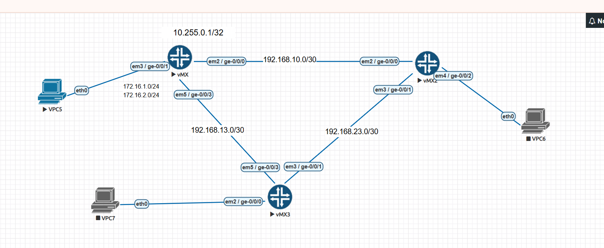
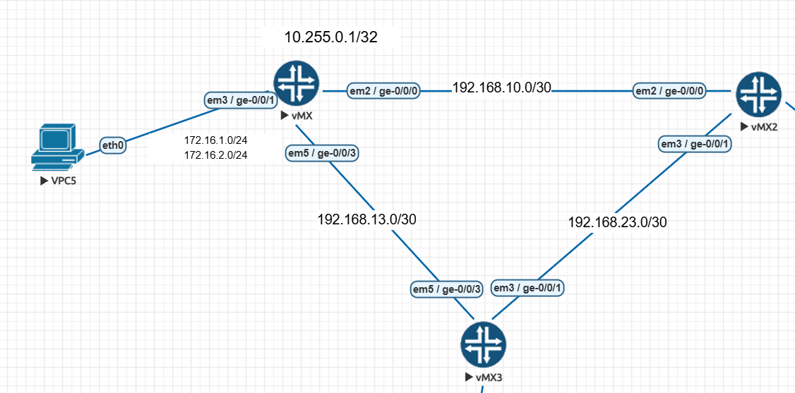
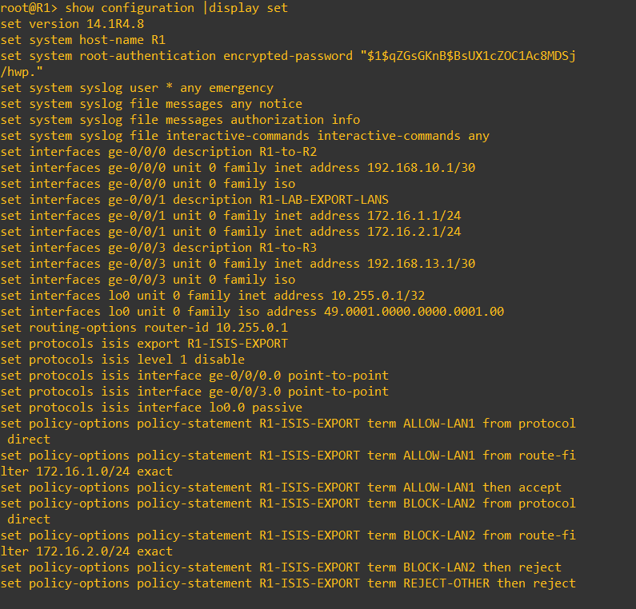
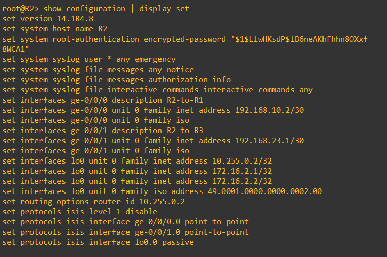
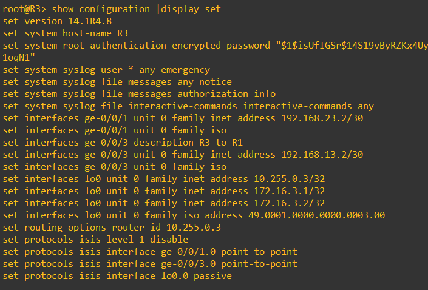
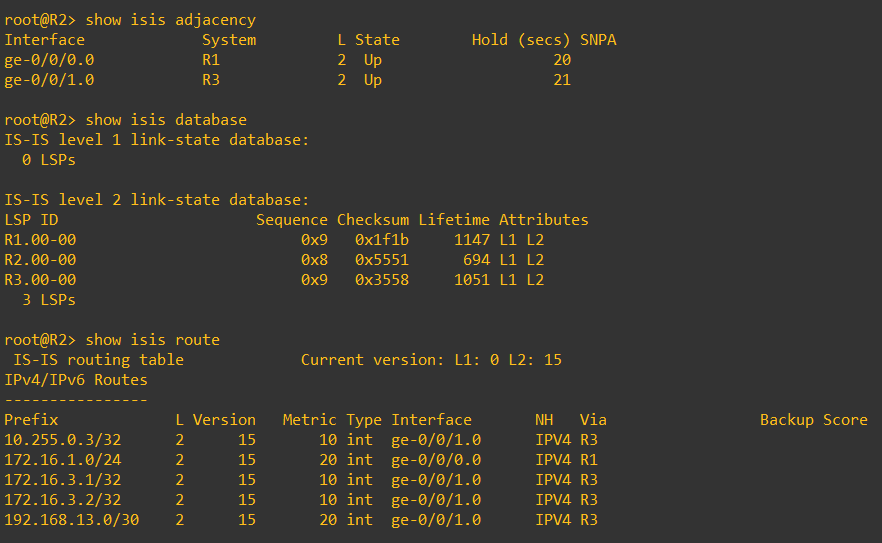
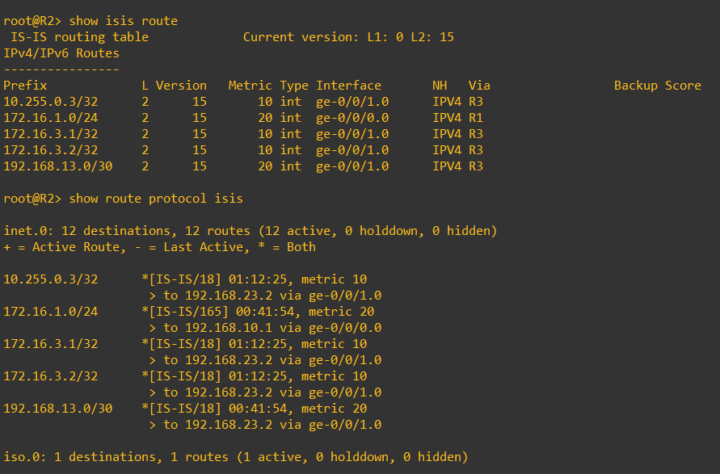
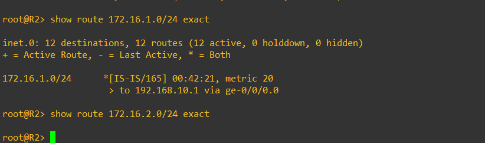
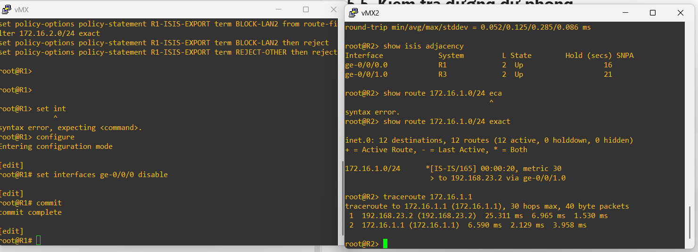

# BÁO CÁO THỰC NGHIỆM IS-IS 3 ROUTER VÀ EXPORT POLICY

## 1. Mục tiêu

Bài lab được thực hiện nhằm:

- Cấu hình IS-IS trên mô hình ba router Juniper.
- Kiểm tra quá trình hình thành láng giềng và trao đổi route.
- Sử dụng Export Policy trên R1 để kiểm soát mạng được quảng bá vào miền IS-IS.
- Kiểm tra khả năng chuyển đường khi một liên kết bị gián đoạn.

---

## 2. Mô hình thực nghiệm

```text
                         192.168.10.0/30
               R1 -------------------------- R2
                \                           /
                 \                         /
          192.168.13.0/30          192.168.23.0/30
                   \                 /
                    \               /
                          R3
```





---

## 3. Bảng địa chỉ IP

| Router | Interface | Địa chỉ IP | Kết nối |
|---|---|---|---|
| R1 | ge-0/0/0.0 | 192.168.10.1/30 | R2 |
| R1 | ge-0/0/3.0 | 192.168.13.1/30 | R3 |
| R1 | lo0.0 | 10.255.0.1/32 | Router ID |
| R1 | ge-0/0/1.0 | 172.16.1.1/24 | LAN được quảng bá |
| R1 | ge-0/0/1.0 | 172.16.2.1/24 | LAN bị chặn |
| R2 | ge-0/0/0.0 | 192.168.10.2/30 | R1 |
| R2 | ge-0/0/1.0 | 192.168.23.1/30 | R3 |
| R2 | lo0.0 | 10.255.0.2/32 | Router ID |
| R3 | ge-0/0/3.0 | 192.168.13.2/30 | R1 |
| R3 | ge-0/0/1.0 | 192.168.23.2/30 | R2 |
| R3 | lo0.0 | 10.255.0.3/32 | Router ID |

### IS-IS NET

| Router | NET |
|---|---|
| R1 | 49.0001.0000.0000.0001.00 |
| R2 | 49.0001.0000.0000.0002.00 |
| R3 | 49.0001.0000.0000.0003.00 |

---

## 4. Cấu hình chính

### 4.1. R1

```junos
set system host-name R1

set interfaces ge-0/0/0 unit 0 family inet address 192.168.10.1/30
set interfaces ge-0/0/0 unit 0 family iso

set interfaces ge-0/0/3 unit 0 family inet address 192.168.13.1/30
set interfaces ge-0/0/3 unit 0 family iso

set interfaces ge-0/0/1 unit 0 family inet address 172.16.1.1/24
set interfaces ge-0/0/1 unit 0 family inet address 172.16.2.1/24

set interfaces lo0 unit 0 family inet address 10.255.0.1/32
set interfaces lo0 unit 0 family iso address 49.0001.0000.0000.0001.00

set routing-options router-id 10.255.0.1

set protocols isis level 1 disable
set protocols isis interface ge-0/0/0.0 point-to-point
set protocols isis interface ge-0/0/3.0 point-to-point
set protocols isis interface lo0.0 passive

set policy-options policy-statement R1-ISIS-EXPORT term ALLOW-LAN1 from protocol direct
set policy-options policy-statement R1-ISIS-EXPORT term ALLOW-LAN1 from route-filter 172.16.1.0/24 exact
set policy-options policy-statement R1-ISIS-EXPORT term ALLOW-LAN1 then accept

set policy-options policy-statement R1-ISIS-EXPORT term BLOCK-LAN2 from protocol direct
set policy-options policy-statement R1-ISIS-EXPORT term BLOCK-LAN2 from route-filter 172.16.2.0/24 exact
set policy-options policy-statement R1-ISIS-EXPORT term BLOCK-LAN2 then reject

set policy-options policy-statement R1-ISIS-EXPORT term REJECT-OTHER then reject
set protocols isis export R1-ISIS-EXPORT
```



### 4.2. R2

```junos
set system host-name R2

set interfaces ge-0/0/0 unit 0 family inet address 192.168.10.2/30
set interfaces ge-0/0/0 unit 0 family iso

set interfaces ge-0/0/1 unit 0 family inet address 192.168.23.1/30
set interfaces ge-0/0/1 unit 0 family iso

set interfaces lo0 unit 0 family inet address 10.255.0.2/32
set interfaces lo0 unit 0 family iso address 49.0001.0000.0000.0002.00

set routing-options router-id 10.255.0.2

set protocols isis level 1 disable
set protocols isis interface ge-0/0/0.0 point-to-point
set protocols isis interface ge-0/0/1.0 point-to-point
set protocols isis interface lo0.0 passive
```



### 4.3. R3

```junos
set system host-name R3

set interfaces ge-0/0/3 unit 0 family inet address 192.168.13.2/30
set interfaces ge-0/0/3 unit 0 family iso

set interfaces ge-0/0/1 unit 0 family inet address 192.168.23.2/30
set interfaces ge-0/0/1 unit 0 family iso

set interfaces lo0 unit 0 family inet address 10.255.0.3/32
set interfaces lo0 unit 0 family iso address 49.0001.0000.0000.0003.00

set routing-options router-id 10.255.0.3

set protocols isis level 1 disable
set protocols isis interface ge-0/0/3.0 point-to-point
set protocols isis interface ge-0/0/1.0 point-to-point
set protocols isis interface lo0.0 passive
```



---

## 5. Kết quả thực nghiệm

### 5.1. Kiểm tra láng giềng IS-IS

```junos
show isis adjacency
```

Kết quả:

- R1 thấy R2 và R3 ở trạng thái `Up`.
- R2 thấy R1 và R3 ở trạng thái `Up`.
- R3 thấy R1 và R2 ở trạng thái `Up`.



### 5.2. Kiểm tra route IS-IS

```junos
show route protocol isis
```

Các router học được loopback và các mạng của nhau thông qua IS-IS.



### 5.3. Kiểm tra Export Policy

Trên R1:

```junos
show route 172.16.1.0/24 exact
show route 172.16.2.0/24 exact
```

R1 có cả hai mạng dưới dạng Direct Route.

Trên R2:

```junos
show route 172.16.1.0/24 exact
show route 172.16.2.0/24 exact
```

Kết quả:

- `172.16.1.0/24`: có route.
- `172.16.2.0/24`: không có route.




### 5.4. Kiểm tra đường dự phòng

Ngắt liên kết R1–R2:

```junos
set interfaces ge-0/0/0 disable
commit
```

Kiểm tra trên R2:

```junos
show isis adjacency
show route 172.16.1.0/24 exact
traceroute 172.16.1.1
```

Sau khi hội tụ, lưu lượng chuyển theo đường:

```text
R2 → R3 → R1
```



Khôi phục liên kết:

```junos
delete interfaces ge-0/0/0 disable
commit
```

---

## 6. Bảng tổng hợp kết quả

| Nội dung | Kết quả |
|---|---|
| Hình thành adjacency giữa ba router | Thành công |
| Trao đổi route qua IS-IS | Thành công |
| Quảng bá mạng 172.16.1.0/24 | Thành công |
| Chặn mạng 172.16.2.0/24 bằng Export Policy | Thành công |
| Ping mạng được phép | Thành công |
| Ping mạng bị chặn | Thất bại đúng dự kiến |
| Chuyển sang đường dự phòng qua R3 | Thành công |

---

## 7. Kết luận

Bài lab đã triển khai thành công giao thức IS-IS trên mô hình ba router. Các router thiết lập adjacency, trao đổi LSP và học route của nhau.

Export Policy trên R1 cho phép mạng `172.16.1.0/24` được quảng bá vào miền IS-IS và từ chối mạng `172.16.2.0/24`. Vì vậy, R2 và R3 chỉ học được mạng được cho phép.

Khi liên kết trực tiếp R1–R2 bị ngắt, IS-IS tự động hội tụ và chuyển lưu lượng qua R3. Kết quả cho thấy IS-IS hỗ trợ định tuyến động, kiểm soát quảng bá route và dự phòng đường truyền.
